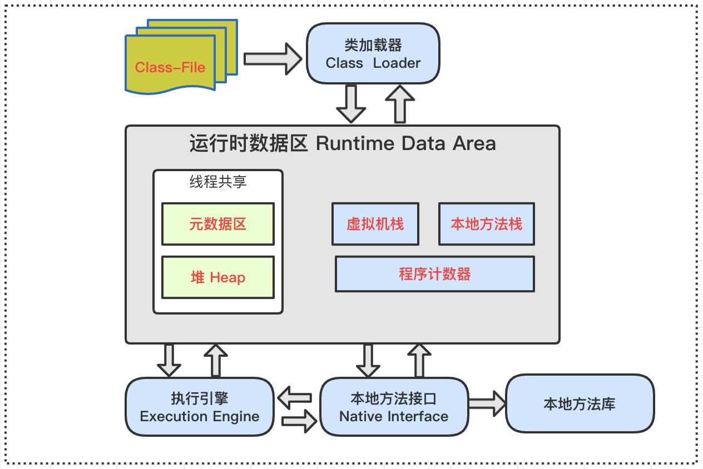

### 1. 面向对象完成功能的三步骤

#### 步骤1：类的定义

类的定义使用关键字：`class`。

**`java.lang.Object`** 是所有类（除原始类型外）的根类（root class）

格式如下：

```
[修饰符] class 类名{
   属性声明;
   方法声明;
 }
```

```java
public class Person{
   //声明属性age
   int age ;           

   //声明方法showAge()
   public void eat() {    
     System.out.println("人吃饭");
   }
}
```

#### 步骤2：对象的创建

**创建对象语法：**

**方式1：给创建的对象命名**
`类名 对象名 = new 类名();`

**方式2：匿名对象**
`new 类名();`

举例：

```java
class PersonTest{
   public static void main(String[] args){
    //创建Person类的对象
    Person per = new Person();
    //创建Dog类的对象
    Dog dog = new Dog();
   }
 }
```

#### 步骤3：对象调用属性或方法

- 使用"对象名.属性" 或 "对象名.方法"的方式访问对象成员（包括属性和方法）

- 匿名对象 (anonymous object)

  我们也可以不定义对象的句柄，而直接调用这个对象的方法。如：new Person().shout(); 

  如果一个对象只需要进行一次方法调用，那么就可以使用匿名对象。经常将匿名对象作为实参传递给一个方法调用。 

### 2. 对象的内存解析

Java虚拟机的架构图如下。其中我们主要关心的是运行时数据区部分（Runtime Data Area）。



- 堆（Heap）：此内存区域的唯一目的就是`存放对象实例`，几乎所有的对象实例都在这里分配内存。所有的对象实例以及数组都要在堆上分配。
- 栈（Stack）：是指虚拟机栈。虚拟机栈用于`存储局部变量`等。局部变量表存放了编译期可知长度的各种基本数据类型（boolean、byte、char、short、int、float、long、double）、对象引用（reference类型，它不等同于对象本身，是对象在堆内存的首地址）。方法执行完，自动释放。
- 方法区（Method Area）：用于存储已被虚拟机加载的类信息、常量、静态变量、即时编译器编译后的代码等数据。

