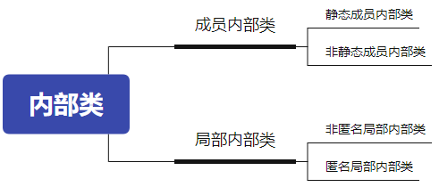

> 在 Java 中，类的成员主要包括以下几种类型：
>
> 1. **成员变量(字段)**：用于存储对象的状态信息。根据其修饰符和位置，成员变量可进一步分为：
>     - **实例变量**：属于对象的变量，每个对象都有自己独立的实例变量。
>     - **类变量(静态变量)**：使用 `static` 修饰，属于类本身，被该类的所有实例共享。
> 2. **方法**：定义对象的行为，包括：
>     - **实例方法**：作用于对象实例，需要通过对象来调用。
>     - **类方法(静态方法)**：使用 `static` 修饰，属于类本身，无需实例化即可调用。
> 3. **构造器(构造方法)**：在创建对象时被调用，用于初始化对象的状态。构造器名称必须与类名相同，没有返回类型。
> 4. **初始化块**：用于在类加载或对象创建时执行特定的初始化代码，包括：
>     - **静态初始化块**：使用 `static` 修饰，在类加载时执行。
>     - **实例初始化块**：不使用 `static` 修饰，在每次创建对象时执行。
> 5. **内部类**：定义在类内部的类，包括：
>     - **成员内部类**：作为外部类的成员存在。
>     - **静态内部类**：使用 `static` 修饰的内部类。
>     - **局部内部类**：定义在方法或代码块内部的类。
>     - **匿名内部类**：没有名称的内部类，通常用于简化代码。
>

## 1. 成员变量(字段)

**成员变量和局部变量的区别**

1.定义位置不同

  a.成员变量:类中方法外
  b.局部变量:定义在方法之中或者参数位置

2.初始化值不同

  a.成员变量:有默认值的,所以不用先手动赋值,就可以直接使用
  b.局部变量:是没有默认值的,所以需要先手动赋值,再使用

3.作用范围不同

  a.成员变量:作用于整个类
  b.局部变量:只作用于自己所在的方法,其他方法使用不了

4.内存位置不同

  a.成员变量:在堆中,跟着对象走
  b.局部变量:在栈中,跟着方法走

5.生命周期不同

  a.成员变量:随着对象的创建而产生,随着对象的消失而消失
  b.局部变量:随着方法的调用而产生,随着方法的调用完毕而消失    

## 2. 方法

### 静态方法的特点

- 静态方法`在本类的任意方法、代码块、构造器中都可以直接被调用`。

- `静态方法属于类`，只要权限修饰符允许，静态方法在其他类中可以通过“类名.静态方法“的方式调用，也可以通过”对象.静态方法“的方式调用

- `在static方法内部只能访问类的static修饰的属性或方法`，不能访问类的非static的结构。但可以通过**显式对象引用**来访问实例成员

  ```java
  public class Demo {
      private int instField = 42;
      private static int staticField = 99;
  
      public static void staticMethod() {
          // 合法：访问同类的 static 成员
          System.out.println(staticField);
  
          // 非法：没有 this，编译器不知道用哪个对象去取 instField
          // System.out.println(instField);  // 编译错误
  
          // 合法：通过显式对象引用来访问实例成员
          Demo obj = new Demo();
          System.out.println(obj.instField);
      }
  }
  ```

- `静态方法可以被子类继承，但不能被子类重写`。

- 静态方法的调用都只看编译时类型。调用时根据**编译时**变量的声明类型来决定调用哪个方法，**不会**发生多态。

  ```java
  class A {
      static void hello() { System.out.println("Hello from A"); }
  }
  
  class B extends A {
      static void hello() { System.out.println("Hello from B"); }
  }
  
  public class Test {
      public static void main(String[] args) {
          A a = new B();
          a.hello();   // 调用 A.hello(), 输出 "Hello from A"
  
          B b = new B();
          b.hello();   // 调用 B.hello(), 输出 "Hello from B"
      }
  }
  ```

- 因为不需要实例就可以访问static方法，因此static方法内部不能有this，也不能有super。如果有重名问题，使用“类名.”进行区别。

## 3. 构造器(构造方法)

- `方法名和类名一致`并且能初始化对象的方法
- `无返回值`

### 3.1 空参构造

1.格式:

```java
public 类名(){

}
```

2.作用: new对象使用
3.特点: 每个类中默认都有一个隐式的无参构造，由jvm自动提供    

### 3.2 有参构造

1.格式:

```java
public 类名(形参){
    为属性赋值
}
```

2.作用:
  a.new对象
  b.为属性赋值
3.特点: 

- jvm不会自动提供有参构造
- 如果将有参构造显式的写出来,jvm将不再提供无参构造

```JAVA
public class Person {
    private String name;
    private int age;

    //无参构造
    public Person(){
        System.out.println("我是无参构造");
    }

    //有参构造
    public Person(String name,int age){
        this.name = name;
        this.age = age;
    }
}
```

## 4. 初始化块(代码块)

对Java类或对象进行初始化

### 4.1 静态代码块

**语法格式**

```java
【修饰符】 class 类{
	static{
        静态代码块
    }
}
```

**特点**

1. 可以有输出语句。

  2. 可以对类的属性、类的声明进行初始化操作。

  3. **不可以对非静态的属性初始化**。即不可以调用非静态的属性和方法。

  4. 若有多个静态的代码块，那么按照从上到下的顺序依次执行。

  5. **静态代码块的执行要先于非静态代码块**。

  6. **静态代码块随着类的加载而加载，且只执行一次**。


### 4.2 非静态代码块

**语法格式**

```java
【修饰符】 class 类{
    {
        非静态代码块
    }
}
```

**非静态代码块的意义**

如果多个重载的构造器有公共代码，并且这些代码都是先于构造器其他代码执行的，那么可以将这部分代码抽取到非静态代码块中，减少冗余代码。

**特点**

1. 可以有输出语句。

  2. 可以对类的属性、类的声明进行初始化操作。

  3. 除了调用非静态的结构外，还**可以调用静态的变量或方法**。

  4. 若有多个非静态的代码块，那么按照从上到下的顺序依次执行。

  5. **每次创建对象的时候，都会执行一次。且先于构造器执行。**


```java
public class Chinese {
    private static String country;
    private String name;

    { // 后执行
        System.out.println("非静态代码块，country = " + country);
    }

    static { // 先执行
        country = "中国";
        System.out.println("静态代码块");
    }

    public Chinese(String name) {
        this.name = name;
    }
}

public class TestStaticBlock {
    public static void main(String[] args) {
        Chinese c1 = new Chinese("张三");
        Chinese c2 = new Chinese("李四");
    }
}
```

## 5. 内部类

- 将一个类A定义在另一个类B里面，里面的那个类A就称为`内部类(InnerClass)`，类B则称为`外部类(OuterClass)`。


- 根据内部类声明的位置(如同变量的分类)，我们可以分为：




### 5.1 成员内部类

如果成员内部类中不使用外部类的非静态成员，那么通常将内部类声明为静态内部类，否则声明为非静态内部类。

**语法格式：**

```java
[修饰符] class 外部类{
    [其他修饰符] [static] class 内部类{
    }
}
```

**成员内部类的使用特征，概括来讲有如下两种角色：**

- 成员内部类作为`类的成员的角色`：

    - 和外部类不同，内部类还可以声明为private或protected；
    - 可以调用外部类的结构；
    - 内部类可以声明为static的，但此时就**不能再使用外层类的非static的成员变量**；

- 成员内部类作为`类的角色`：

    - 可以在内部定义属性、方法、构造器等结构

    - 可以继承自己的想要继承的父类，实现自己想要实现的父接口们，和外部类的父类和父接口无关

    - 可以声明为abstract类 ，因此可以被其它的内部类继承

    - 可以声明为final的，表示不能被继承

    - 编译以后生成OuterClass$InnerClass.class字节码文件(也适用于局部内部类)  

- 外部类访问成员内部类的成员，需要“内部类.成员”或“内部类对象.成员”的方式

- 成员内部类可以直接使用外部类的所有成员，包括私有的数据

- 当想要在外部类的静态成员部分使用内部类时，可以考虑内部类声明为静态的

**创建成员内部类对象**

- 实例化静态内部类

```
外部类名.静态内部类名 变量 = 外部类名.静态内部类名();
变量.非静态方法();
```

- 实例化非静态内部类

1. **外部类引用 + `new`**

   ```
   Outer outer = new Outer();
   Outer.NoStaticInner inner = outer.new NoStaticInner();
   ```

2. **由外部类方法间接创建(工厂方法)**

   ```java
   Outer outer = new Outer();
   Outer.NoStaticInner inner = outer.getNoStaticInner();
   ```

   利用外部类自己写的 `getNoStaticInner()`，对实例化细节进行了封装。

3. **在外部类内部直接 `new`**
    在 `Outer` 的任何实例方法或构造器内部，可以直接写：

   ```java
   NoStaticInner inner = new NoStaticInner();
   ```

   因为此时编译器已经知道“this”指的是哪个 `Outer` 对象，所以允许你直接 `new`。

**举例**

```java
public class TestMemberInnerClass {
    public static void main(String[] args) {
        //创建静态内部类实例，并调用方法
        Outer.StaticInner inner = new Outer.StaticInner();
        inner.inFun();
        //调用静态内部类静态方法
        Outer.StaticInner.inMethod();

        System.out.println("*****************************");

        //创建非静态内部类实例(方式1)，并调用方法
        Outer outer = new Outer();
        Outer.NoStaticInner inner1 = outer.new NoStaticInner();
        inner1.inFun();

        //创建非静态内部类实例(方式2)
        Outer.NoStaticInner inner2 = outer.getNoStaticInner();
        inner1.inFun();
    }
}
class Outer{
    private static String a = "外部类的静态a";
    private static String b  = "外部类的静态b";
    private String c = "外部类对象的非静态c";
    private String d = "外部类对象的非静态d";

    static class StaticInner{
        private static String a ="静态内部类的静态a";
        private String c = "静态内部类对象的非静态c";
        public static void inMethod(){
            System.out.println("Inner.a = " + a);
            System.out.println("Outer.a = " + Outer.a);
            System.out.println("b = " + b);
        }
        public void inFun(){
            System.out.println("Inner.inFun");
            System.out.println("Outer.a = " + Outer.a);
            System.out.println("Inner.a = " + a);
            System.out.println("b = " + b);
            System.out.println("c = " + c);
            // System.out.println("d = " + d);// 错误，不能访问外部类的非静态成员
        }
    }

    class NoStaticInner{
        private String a = "非静态内部类对象的非静态a";
        private String c = "非静态内部类对象的非静态c";

        public void inFun(){
            System.out.println("NoStaticInner.inFun");
            System.out.println("Outer.a = " + Outer.a);
            System.out.println("a = " + a);
            System.out.println("b = " + b);
            System.out.println("Outer.c = " + Outer.this.c);
            System.out.println("c = " + c);
            System.out.println("d = " + d);
        }
    }
    
	// 工厂方法，它封装了 new NoStaticInner() 的细节，提高了可读性
    public NoStaticInner getNoStaticInner(){
        return new NoStaticInner();
    }
}
```

### 5.2 局部内部类

#### 5.2.1 非匿名局部内部类

**语法格式：**

```java
[修饰符] class 外部类{
    [修饰符] 返回值类型  方法名(形参列表){
        [final/abstract] class 内部类{
        }
    }    
}
```

- 编译后有自己的独立的字节码文件，只不过在内部类名前面冠以外部类名、$符号、编号;

* 和成员内部类不同的是,前面不能有权限修饰符等;
* 局部内部类如同局部变量一样，有作用域;
* 局部内部类中是否能访问外部类的非静态的成员，取决于所在的方法

**举例：**

```java
public class TestLocalInner {
    public static void main(String[] args) {
        Outer.outMethod();
        System.out.println("-------------------");

        Outer out = new Outer();
        out.outTest();
        System.out.println("-------------------");

        Runner runner = Outer.getRunner();
        runner.run();
    }
}
class Outer{
    public static void outMethod(){
        System.out.println("Outer.outMethod");
        final String c = "局部变量c";
        
        class Inner{
            public void inMethod(){
                System.out.println("Inner.inMethod");
                System.out.println(c);
            }
        }

        Inner in = new Inner();
        in.inMethod();
    }

    public void outTest(){
        class Inner{
            public void inMethod1(){
                System.out.println("Inner.inMethod1");
            }
        }

        Inner in = new Inner();
        in.inMethod1();
    }

    public static Runner getRunner(){
        class LocalRunner implements Runner{
            @Override
            public void run() {
                System.out.println("LocalRunner.run");
            }
        }
        return new LocalRunner();
    }

}

interface Runner{
    void run();
}
```

#### 5.2.2 匿名内部类

**语法格式:**

```java
new 父类([实参列表]){
    重写方法...
}
```

```java
new 父接口(){
    重写方法...
}
```

举例1：使用匿名内部类的对象直接调用方法：

```java
interface A{
    void a();
}
public class junitTest{
    public static void main(String[] args){
        new A(){
            @Override
            public void a() {
                System.out.println("aaaa");
            }
        }.a();
    }
}
```

举例2：通过父类或父接口的变量多态引用匿名内部类的对象

```java
interface A{
	void a();
}
public class junitTest{
    public static void main(String[] args){
    	A obj = new A(){
			@Override
			public void a() {
				System.out.println("aaaa");
			}
    	};
    	obj.a();
    }
}
```

举例3：匿名内部类的对象作为实参

```java
interface A{
	void method();
}
public class junitTest{
    public static void test(A a){
    	a.method();
    }
    
    public static void main(String[] args){
    	test(new A(){

			@Override
			public void method() {
				System.out.println("aaaa");
			}
    	});
    }   
}
```
