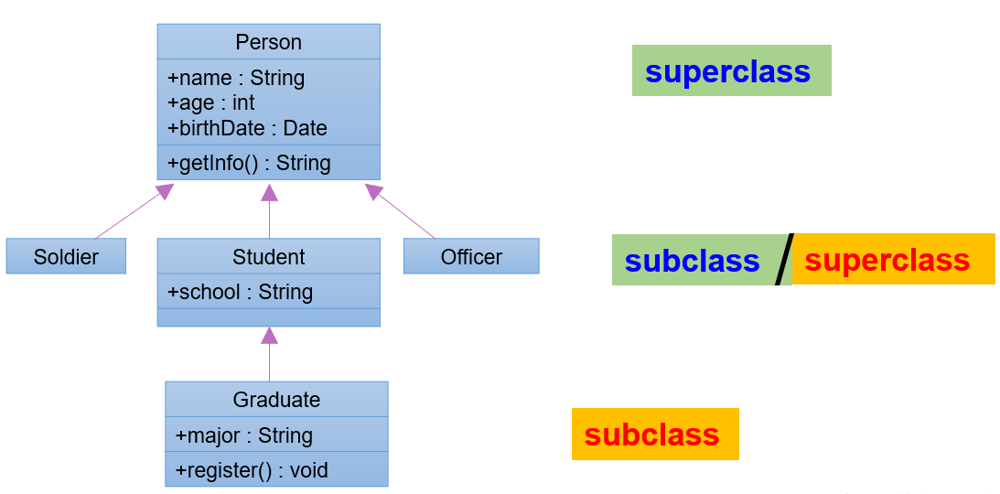

## 1. 继承

### 1.1 继承的语法格式

```java
[修饰符] class 类A {
	...
}

[修饰符] class 类B extends 类A {
	...
}
```

- 类B，称为子类、派生类(derived class)、SubClass

- 类A，称为父类、超类、基类(base class)、SuperClass

**例子：**

```java
public class Employee {
    String name;
    int age;

    public void work(){
        System.out.println("工作");
    }

    private void eat(){
        System.out.println("员工要干饭");
    }
}

```

```java
public class Teacher extends Employee{

}

```

```java
public class Manager extends Employee{
}

```

```java
public class Test01 {
    public static void main(String[] args) {
        Teacher teacher = new Teacher();
        teacher.name = "涛哥";
        teacher.age = 18;
        System.out.println(teacher.name+"..."+teacher.age);
        teacher.work();
        //teacher.eat();子类继承父类之后不能使用父类私有成员,只能使用父类非私有成员

        System.out.println("============");

        Manager manager = new Manager();
        manager.name = "金莲";
        manager.age = 18;
        System.out.println(manager.name+"..."+manager.age);
        manager.work();
    }
}

```

### 1.2 继承的特性

**1. 子类会继承父类所有的实例变量和实例方法**

当子类对象调用方法时，编译器会先在子类模板中看该类是否有这个方法，如果没找到，会遵循`从下往上`找的顺序在其父类中寻找，直至找到；或是直到根父类都没有找到，就报编译错误。

**2. 子类不能直接访问父类中私有的(private)的成员变量和方法**

子类虽会继承父类私有(private)的成员变量，但子类不能对继承的私有成员变量直接进行访问，可通过继承的get/set方法进行访问。

**3. 在Java 中，继承的关键字用的是“extends”，即子类不是父类的子集，而是对父类的“扩展”**

子类在继承父类以后，还可以定义自己特有的方法，这就可以看做是对父类功能上的扩展。

**4. Java支持多层继承**

**顶层父类是Object类。所有的类默认继承Object**



**5、一个父类可以同时拥有多个子类**

```java
class A{}
class B extends A{}
class D extends A{}
class E extends A{}
```

**6、Jav不支持多重继承**

```java
public class A{}
class B extends A{}

//一个类只能有一个父类，不可以有多个直接父类。
class C extends B{} 	//ok
class C extends A,B...	//error
```


## 2. 方法的重写（override/overwrite）

### 2.1 概述

1. 定义：子类中有一个和父类方法名以及参数列表相同的方法

2. 前提：继承

### 2.2 要求

1. 子类重写的方法`必须`和父类被重写的方法具有相同的`方法名称`、`参数列表`。

2. 子类重写的方法的返回值类型`不能大于`父类被重写的方法的返回值类型。如果返回值类型是基本数据类型和void，那么必须是相同

3. 子类重写的方法使用的访问权限`不能小于`父类被重写的方法的访问权限。（public > protected > 缺省 > private）

   **私有方法不能被重写,构造方法不能被重写,静态方法不能被重写，跨包的父类缺省的方法也不能重写**

4. 子类方法抛出的异常不能大于父类被重写方法的异常

### 2.3 调用顺序

看new后面的,如果new的是子类则调用子类重写的方法,否则调用父类的方法

### 2.4 `@Override`

写在方法上面，用来检测是不是满足重写方法的要求。这个注解就算不写，只要满足要求，也是正确的方法覆盖重写。

举例：

```java
public class Fu {
    public void methodFu(){
        System.out.println("我是父类中的methodFu方法");
    }
    public void method(){
        System.out.println("我是父类中的method方法");
    }
}
```

```java
public class Zi extends Fu{
    public void methodZi(){
        System.out.println("我是子类中的methodZi方法");
    }

    @Override
    public void method(){
        System.out.println("我是子类中的method方法");
    }
```

```java
public class Test01 {
    public static void main(String[] args) {
        Fu fu = new Fu();
        fu.methodFu();//自己的methodFu方法
        fu.method();//new的是父类对象,那么调用的就是父类中的method

        System.out.println("================");

        Zi zi = new Zi();
        zi.methodZi();
        zi.methodFu();
        zi.method();//子类中的method方法
    }
}

```

## 3. `super`

**在Java类中使用super来调用父类中的指定操作：**

- **子类中调用父类中同名的成员变量**
- **子类中调用父类被重写的方法**
- **在子类构造器中调用父类的构造器**

### 3.1 子类中调用父类中同名的成员变量

- 如果子类实例变量和父类实例变量重名，并且父类的该实例变量在子类仍然可见，在子类中要访问父类声明的实例变量需要在父类实例变量前加super.，否则默认访问的是子类自己声明的实例变量
- 如果父子类实例变量没有重名，只要权限修饰符允许，在子类中完全可以直接访问父类中声明的实例变量，也可以用this.实例访问，也可以用super.实例变量访问

举例：

```java
class Father{
	int a = 10;
	int b = 11;
}
class Son extends Father{
	int a = 20;
    
    public void test(){
		//子类与父类的属性同名，子类对象中就有两个a
		System.out.println("子类的a：" + a);//20  先找局部变量找，没有再从本类成员变量找
        System.out.println("子类的a：" + this.a);//20   先从本类成员变量找
        System.out.println("父类的a：" + super.a);//10    直接从父类成员变量找
		
		//子类与父类的属性不同名，是同一个b
		System.out.println("b = " + b);//11  先找局部变量找，没有再从本类成员变量找，没有再从父类找
		System.out.println("b = " + this.b);//11   先从本类成员变量找，没有再从父类找
		System.out.println("b = " + super.b);//11  直接从父类局部变量找
	}
	
	public void method(int a, int b){
		//子类与父类的属性同名，子类对象中就有两个成员变量a，此时方法中还有一个局部变量a		
		System.out.println("局部变量的a：" + a);//30  先找局部变量
        System.out.println("子类的a：" + this.a);//20  先从本类成员变量找
        System.out.println("父类的a：" + super.a);//10  直接从父类成员变量找

        System.out.println("b = " + b);//13  先找局部变量
		System.out.println("b = " + this.b);//11  先从本类成员变量找
		System.out.println("b = " + super.b);//11  直接从父类局部变量找
    }
}
class Test{
    public static void main(String[] args){
        Son son = new Son();
		son.test();
		son.method(30,13);  
    }
}
```

**总结：**

* **变量前面没有`super.`和`this.`**
  * 在构造器、代码块、方法中如果出现使用某个变量，先查看是否是当前块声明的`局部变量`，
  * 如果不是局部变量，先从当前执行代码的`本类去找成员变量`
  * 如果从当前执行代码的本类中没有找到，会往上找`父类声明的成员变量`（权限修饰符允许在子类中访问的）
* **变量前面有`this.`** 
  * 通过this找成员变量时，先从当前执行代码的`本类去找成员变量`
  * 如果从当前执行代码的本类中没有找到，会往上找`父类声明的成员变量`（权限修饰符允许在子类中访问的）
* **变量前面`super.`** 
  * 通过super找成员变量，直接从当前执行代码的直接父类去找成员变量（权限修饰符允许在子类中访问的）
  * 如果直接父类没有，就去父类的父类中找（权限修饰符允许在子类中访问的）

### 3.2 子类中调用父类被重写的方法

- 如果子类没有重写父类的方法，只要权限修饰符允许，在子类中完全可以直接调用父类的方法；
- 如果子类重写了父类的方法，在子类中需要通过`super.`才能调用父类被重写的方法，否则默认调用的子类重写的方法

举例：

```java
package com.atguigu.inherited.method;

public class Phone {
    public void sendMessage(){
        System.out.println("发短信");
    }
    public void call(){
        System.out.println("打电话");
    }
    public void showNum(){
        System.out.println("来电显示号码");
    }
}

//smartphone：智能手机
public class SmartPhone extends Phone{
    //重写父类的来电显示功能的方法
    public void showNum(){
        //来电显示姓名和图片功能
        System.out.println("显示来电姓名");
        System.out.println("显示头像");

        //保留父类来电显示号码的功能
        super.showNum();//此处必须加super.，否则就是无限递归，那么就会栈内存溢出
    }
}
```

**总结：**

* **方法前面没有super.和this.**
  * 先从子类找匹配方法，如果没有，再从直接父类找，再没有，继续往上追溯

* **方法前面有this.**
  * 先从子类找匹配方法，如果没有，再从直接父类找，再没有，继续往上追溯

* **方法前面有super.**
  * 从当前子类的直接父类找，如果没有，继续往上追溯

**<font color='red'>特别说明：应该避免子类声明和父类重名的成员变量</font>**

### 3.3 子类构造器中调用父类构造器

1. 子类继承父类时，不会继承父类的构造器。只能通过`super(形参列表)`的方式调用父类指定的构造器。

2. `super(形参列表)`必须声明在构造器的首行。

3. 在构造器的首行，"this(形参列表)" 和 "super(形参列表)"只能二选一。

4. 子类的任何一个构造器中，要么调用本类中重载的构造器，要么调用父类的构造器。

   如果子类构造器中既未显式调用父类或本类的构造器，且父类中又没有空参的构造器，则`编译出错`。

5. 如果在子类构造器的首行既没有显示调用`this(形参列表)`，也没有显式调用`super(形参列表)`，则子类此构造器默认调用`super()`

6. 一个类中声明有n个构造器，最多有n-1个构造器中使用了"this(形参列表)"，则剩下的那个一定使用"super(形参列表)"。


情景举例1：

```java
class A{

}
class B extends A{

}

class Test{
    public static void main(String[] args){
        B b = new B();
        //A类和B类都是默认有一个无参构造，B类的默认无参构造中还会默认调用A类的默认无参构造
        //但是因为都是默认的，没有打印语句，看不出来
    }
}
```

情景举例2：

```java
class A{
	A(){
		System.out.println("A类无参构造器");
	}
}
class B extends A{

}
class Test{
    public static void main(String[] args){
        B b = new B();
        //A类显示声明一个无参构造，
		//B类默认有一个无参构造，
		//B类的默认无参构造中会默认调用A类的无参构造
        //可以看到会输出“A类无参构造器"
    }
}
```

情景举例3：

```java
class A{
	A(){
		System.out.println("A类无参构造器");
	}
}
class B extends A{
	B(){
		System.out.println("B类无参构造器");
	}
}
class Test{
    public static void main(String[] args){
        B b = new B();
        //A类显示声明一个无参构造，
		//B类显示声明一个无参构造，        
		//B类的无参构造中虽然没有写super()，但是仍然会默认调用A类的无参构造
        //可以看到会输出“A类无参构造器"和"B类无参构造器")
    }
}
```

情景举例4：

```java
class A{
	A(){
		System.out.println("A类无参构造器");
	}
}
class B extends A{
	B(){
        super();
		System.out.println("B类无参构造器");
	}
}
class Test{
    public static void main(String[] args){
        B b = new B();
        //A类显示声明一个无参构造，
		//B类显示声明一个无参构造，        
		//B类的无参构造中明确写了super()，表示调用A类的无参构造
        //可以看到会输出“A类无参构造器"和"B类无参构造器")
    }
}
```

情景举例5：

```java
class A{
	A(int a){
		System.out.println("A类有参构造器");
	}
}
class B extends A{
	B(){
		System.out.println("B类无参构造器");
	}
}
class Test05{
    public static void main(String[] args){
        B b = new B();
        //A类显示声明一个有参构造，没有写无参构造，那么A类就没有无参构造了
		//B类显示声明一个无参构造，        
		//B类的无参构造没有写super(...)，表示默认调用A类的无参构造
        //编译报错，因为A类没有无参构造
    }
}
```

情景举例6：

```java
class A{
	A(int a){
		System.out.println("A类有参构造器");
	}
}
class B extends A{
	B(){
		super();
		System.out.println("B类无参构造器");
	}
}
class Test06{
    public static void main(String[] args){
        B b = new B();
        //A类显示声明一个有参构造，没有写无参构造，那么A类就没有无参构造了
		//B类显示声明一个无参构造，        
		//B类的无参构造明确写super()，表示调用A类的无参构造
        //编译报错，因为A类没有无参构造
    }
}
```

情景举例7：

```java
class A{
	A(int a){
		System.out.println("A类有参构造器");
	}
}
class B extends A{
	B(int a){
		super(a);
		System.out.println("B类有参构造器");
	}
}
class Test07{
    public static void main(String[] args){
        B b = new B(10);
        //A类显示声明一个有参构造，没有写无参构造，那么A类就没有无参构造了
		//B类显示声明一个有参构造，        
		//B类的有参构造明确写super(a)，表示调用A类的有参构造
        //会打印“A类有参构造器"和"B类有参构造器"
    }
}
```

情景举例8：

```java
class A{
    A(){
        System.out.println("A类无参构造器");
    }
	A(int a){
		System.out.println("A类有参构造器");
	}
}
class B extends A{
    B(){
        super();//可以省略，调用父类的无参构造
        System.out.println("B类无参构造器");
    }
	B(int a){
		super(a);//调用父类有参构造
		System.out.println("B类有参构造器");
	}
}
class Test8{
    public static void main(String[] args){
        B b1 = new B();
        B b2 = new B(10);
    }
}
```

