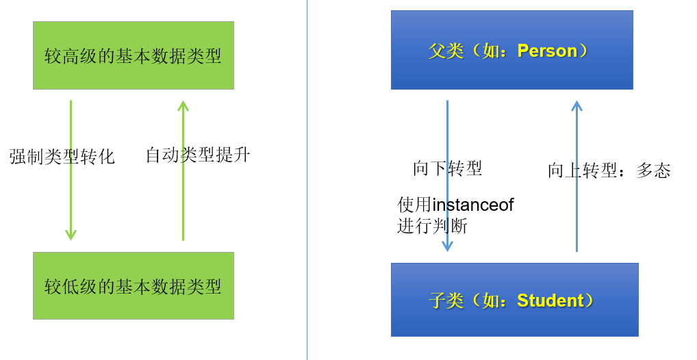

## 1. 多态(Polymorphism)的形式和体现

### 1.1 对象的多态性

**对象的多态性：父类的引用指向子类的对象**

多态的使用前提：类的继承关系 + 方法的重写

格式：（父类类型：指子类继承的父类类型，或者实现的接口类型）

```java
父类类型 变量名 = 子类对象；
```

举例：

```java
Person p = new Student();
Object o = new Person();//Object类型的变量o，指向Person类型的对象
o = new Student(); //Object类型的变量o，指向Student类型的对象
```

### 1.2 多态的实现

- Java引用变量有两个类型：`编译时类型`和`运行时类型`。编译时类型由`声明`该变量时使用的类型决定，运行时类型由`实际赋给该变量的对象`决定。

  即`编译时，看左边；运行时，看右边`

  “看左边”：看的是父类的引用（父类中不具备子类特有的方法）
  “看右边”：看的是子类的对象（实际运行的是子类重写父类的方法）

- 若编译时类型和运行时类型不一致，就出现了对象的多态性(Polymorphism)

### 1.3 多态的体现方式

```java
package com.atguigu.polymorphism.grammar;

public class Pet {
    private String nickname; //昵称

    public String getNickname() {
        return nickname;
    }

    public void setNickname(String nickname) {
        this.nickname = nickname;
    }

    public void eat(){
        System.out.println(nickname + "吃东西");
    }
}
```

```java
package com.atguigu.polymorphism.grammar;

public class Cat extends Pet {
    //子类重写父类的方法
    @Override
    public void eat() {
        System.out.println("猫咪" + getNickname() + "吃鱼仔");
    }

    //子类扩展的方法
    public void catchMouse() {
        System.out.println("抓老鼠");
    }
}
```

```java
package com.atguigu.polymorphism.grammar;

public class Dog extends Pet {
    //子类重写父类的方法
    @Override
    public void eat() {
        System.out.println("狗子" + getNickname() + "啃骨头");
    }

    //子类扩展的方法
    public void watchHouse() {
        System.out.println("看家");
    }
}
```

**1. 方法内局部变量的赋值体现多态**

```java
package com.atguigu.polymorphism.grammar;

public class TestPet {
    public static void main(String[] args) {
        //多态引用
        Pet pet = new Dog();
        pet.setNickname("小白");

        //多态的表现形式
        /*
        编译时看父类：只能调用父类声明的方法，不能调用子类扩展的方法；
        运行时，看“子类”，如果子类重写了方法，一定是执行子类重写的方法体；
         */
        pet.eat();//运行时执行子类Dog重写的方法
//      pet.watchHouse();//不能调用Dog子类扩展的方法

        pet = new Cat();
        pet.setNickname("雪球");
        pet.eat();//运行时执行子类Cat重写的方法
    }
}
```

**2. 方法的形参声明体现多态**

```java
package com.atguigu.polymorphism.grammar;

public class Person{
    private Pet pet;
    public void adopt(Pet pet) {//形参是父类类型，实参是子类对象
        this.pet = pet;
    }
    public void feed(){
        pet.eat();//pet实际引用的对象类型不同，执行的eat方法也不同
    }
}
```

```java
package com.atguigu.polymorphism.grammar;

public class TestPerson {
    public static void main(String[] args) {
        Person person = new Person();

        Dog dog = new Dog();
        dog.setNickname("小白");
        person.adopt(dog);//实参是dog子类对象，形参是父类Pet类型
        person.feed();

        Cat cat = new Cat();
        cat.setNickname("雪球");
        person.adopt(cat);//实参是cat子类对象，形参是父类Pet类型
        person.feed();
    }
}
```

**3. 方法返回值类型体现多态**

```java
package com.atguigu.polymorphism.grammar;

public class PetShop {
    //返回值类型是父类类型，实际返回的是子类对象
    public Pet sale(String type){
        switch (type){
            case "Dog":
                return new Dog();
            case "Cat":
                return new Cat();
        }
        return null;
    }
}
```

```java
package com.atguigu.polymorphism.grammar;

public class TestPetShop {
    public static void main(String[] args) {
        PetShop shop = new PetShop();

        Pet dog = shop.sale("Dog");
        dog.setNickname("小白");
        dog.eat();

        Pet cat = shop.sale("Cat");
        cat.setNickname("雪球");
        cat.eat();
    }
}
```

> ### 成员变量没有多态性
>
> - 若子类重写了父类方法，就意味着子类里定义的方法彻底覆盖了父类里的同名方法，系统将不可能把父类里的方法转移到子类中。
>
> - 对于实例变量则不存在这样的现象，即使子类里定义了与父类完全相同的实例变量，这个实例变量依然不可能覆盖父类中定义的实例变量

---

## 2. 多态的好处和弊端

**好处**：变量引用的子类对象不同，执行的方法就不同，实现动态绑定。代码编写更灵活、功能更强大，可维护性和扩展性更好了。

**弊端**：一个引用类型变量如果声明为父类的类型，但实际引用的是子类对象，那么该变量就不能再访问子类中添加的属性和方法。

```java
Student m = new Student();
m.school = "pku"; 	//合法,Student类有school成员变量
Person e = new Student(); 
e.school = "pku";	//非法,Person类没有school成员变量
// 属性是在编译时确定的，编译时e为Person类型，没有school成员变量，因而编译错误。
```

> 使用父类做方法的形参，是多态使用最多的场合。即使增加了新的子类，方法也无需改变，提高了扩展性，符合开闭原则。
>
> 开闭原则 (OCP)
>
> - 对扩展开放，对修改关闭
> - 通俗解释：软件系统中的各种组件，如模块（Modules）、类（Classes）以及功能（Functions）等，应该在不修改现有代码的基础上，引入新功能

---

## 3. 虚方法调用(Virtual Method Invocation)

**虚方法**是指在面向对象编程中，实例方法（非 static、非 private、非 final 方法）在调用时不是在编译期绑定到某个特定实现，而是在运行时根据对象的实际类型来决定调用哪个实现。这一机制就是所谓的**动态绑定**（Dynamic Binding）或**多态**。

```java
Person e = new Student();
e.getInfo();	//调用Student类的getInfo()方法
```

- **默认虚拟性**
   在 Java 中，除去 private、static 和 final 修饰的方法，其它实例方法默认都是虚方法，即使没有显式声明 `virtual`（Java 没有虚拟关键字）。

- **动态绑定**
   在编译时，方法调用的绑定仅基于引用的静态类型；但在运行时，Java 根据对象的实际类型进行动态查找（通过 vtable 机制），调用最具体的实现。

- **支持多态**
   虚方法使得子类能够通过重写（Override）来改变父类中定义的行为，实现运行时多态性。

  例如：

  ```java
  class Animal {
      public void sound() {
          System.out.println("Animal makes a sound");
      }
  }
  
  class Dog extends Animal {
      @Override
      public void sound() {
          System.out.println("Dog barks");
      }
  }
  
  public class junitTest {
      public static void main(String[] args) {
          Animal a = new Dog();  // 父类引用指向子类对象
          a.sound();             // 输出 "Dog barks"
      }
  }
  ```

  上述例子中，尽管引用类型是 `Animal`，但实际调用的是 `Dog` 中重写的 `sound()` 方法，这就是虚方法调用的动态绑定机制。

**虚方法调用与非虚方法调用的区别**

| 特性         | 虚方法调用                                      | 非虚方法调用                          |
| ------------ | ----------------------------------------------- | ------------------------------------- |
| **绑定时机** | 运行时动态绑定（多态）                          | 编译时静态绑定                        |
| **适用方法** | 普通实例方法（非 private、非 static、非 final） | private 方法、static 方法、final 方法 |
| **多态支持** | 支持子类重写，从而实现多态性                    | 不支持重写，调用与对象实际类型无关    |
| **实现机制** | 通过 vtable 实现动态分派                        | 直接调用编译期确定的地址或内联实现    |

---

## 4. 向上转型与向下转型



### 1. 向上转型

```
Pet pet = new Dog();
```

- 当左边的变量的类型（父类） > 右边对象/变量的类型（子类），我们就称为向上转型
- 此时，编译时按照左边变量的类型处理，就只能调用父类中有的变量和方法，不能调用子类特有的变量和方法了
- 但是，**运行时，仍然是对象本身的类型**，所以执行的方法是子类重写的方法体。
- 此时，一定是安全的，而且也是自动完成的

### 2. 向下转型

```
Dog d = (Dog) pet;
```

- 当左边的变量的类型（子类）<右边对象/变量的编译时类型（父类），我们就称为向下转型

* 此时，编译时按照左边变量的类型处理，就可以调用子类特有的变量和方法了
* 但是，**运行时，仍然是对象本身的类型**
* 不是所有通过编译的向下转型都是正确的，可能会发生ClassCastException，为了安全，可以通过isInstanceof关键字进行判断

```java
package com.atguigu.polymorphism.grammar;

public class ClassCastTest {
    public static void main(String[] args) {
        //没有类型转换
        Dog dog = new Dog();//dog的编译时类型和运行时类型都是Dog

        //向上转型
        Pet pet = new Dog();//pet的编译时类型是Pet，运行时类型是Dog
        pet.setNickname("小白");
        pet.eat();//可以调用父类Pet有声明的方法eat，但执行的是子类重写的eat方法体
//        pet.watchHouse();//不能调用父类没有的方法watchHouse
		
        //向下转型
        Dog d = (Dog) pet;
        System.out.println("d.nickname = " + d.getNickname());
        d.eat();//可以调用eat方法
        d.watchHouse();//可以调用子类扩展的方法watchHouse

        Cat c = (Cat) pet;//编译通过，因为从语法检查来说，pet的编译时类型是Pet，Cat是Pet的子类，所以向下转型语法正确
        //这句代码运行报错ClassCastException，因为pet变量的运行时类型是Dog，Dog和Cat之间是没有继承关系的
    }
}
```

### 3. instanceof关键字

格式：

```java
//检验对象a是否是数据类型A的对象，返回值为boolean型
对象a instanceof 数据类型A 
```

- 只要用instanceof判断返回true的，那么强转为该类型就一定是安全的，不会报ClassCastException异常。
- 如果对象a属于类A的子类B，a instanceof A值也为true。
- 要求对象a所属的类与类A必须是子类和父类的关系，否则编译错误。

```java
package com.atguigu.polymorphism.grammar;

public class TestInstanceof {
    public static void main(String[] args) {
        Pet[] pets = new Pet[2];
        pets[0] = new Dog();//多态引用
        pets[0].setNickname("小白");
        pets[1] = new Cat();//多态引用
        pets[1].setNickname("雪球");

        for (int i = 0; i < pets.length; i++) {
            pets[i].eat();

            if(pets[i] instanceof Dog){
                Dog dog = (Dog) pets[i];
                dog.watchHouse();
            }else if(pets[i] instanceof Cat){
                Cat cat = (Cat) pets[i];
                cat.catchMouse();
            }
        }
    }
}
```

