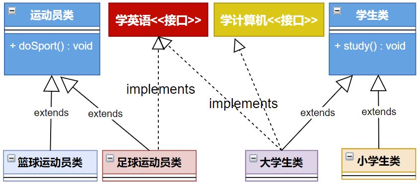

## 1. 语法格式

```java
[修饰符] interface 接口名{
    // 接口的成员列表：
    // 公共的静态常量
    // 公共的抽象方法
    
    // 公共的默认方法(JDK1.8以上)
    // 公共的静态方法(JDK1.8以上)
    // 私有方法(JDK1.9以上)
}
```

示例：

```java
public interface USB3{
    // 静态常量
    long MAX_SPEED = 500*1024*1024;// 500MB/s

    // 抽象方法
    void in();
    void out();

    // 默认方法
    default void start(){
        System.out.println("开始");
    }
    default void stop(){
        System.out.println("结束");
    }

    // 静态方法
    static void show(){
        System.out.println("USB 3.0可以同步全速地进行读写操作");
    }
}
```

## 2. 接口的成员

**JDK8.0 前：**

- 公共的静态的常量`public static final int A`,其中`public static final`可以省略 -> `int A`

- 公共的抽象的方法`public abstract void print()`,其中`public abstract`可以省略 -> `void print()`

**JDK8.0 中增加：**

- 公共的默认的方法`public default void start()`，其中`public`可以省略 -> `default void start()`

- 公共的静态的方法`public static void stop()`,其中`public`可以省略 -> `static void start()`

**JDK9.0 中增加：**

- 私有方法`private`前缀修饰：私有方法只能在接口内部调用，不能被实现类或其他外部类访问

## 3. 接口的使用规则

### 3.1 类实现接口(implements)

接口**不能创建对象**，但是可以**被类实现(implements)**；

类与接口的关系为实现关系，即**类实现接口**，该类可以称为**接口的实现类**

```java
【修饰符】 class 实现类  implements 接口{
	// 重写接口中抽象方法【必须】，当然如果实现类是抽象类，那么可以不重写
  	// 重写接口中默认方法【可选】
}

【修饰符】 class 实现类 extends 父类 implements 接口{
    // 重写接口中抽象方法【必须】，如果实现类是抽象类可以不重写
  	// 重写接口中默认方法【可选】
}
```

- 如果接口的实现类是非抽象类，那么必须`重写接口中所有抽象方法`。
- `默认方法可以选择保留，也可以重写`。
- `接口中的静态方法不能被继承也不能被重写`

举例：

```java
interface USB{		
    public void start();
    public void stop();	
}

class Computer{
    public static void show(USB usb){	
        usb.start();
        System.out.println("=========== USB 设备工作 ========") ;
        usb.stop();
    }
}

class Flash implements USB{
    public void start(){	// 重写方法
        System.out.println("U盘开始工作。");
    }
    public void stop(){		// 重写方法
        System.out.println("U盘停止工作。");
    }
}

class Print implements USB{
    public void start(){	// 重写方法
        System.out.println("打印机开始工作。");
    }
    public void stop(){		// 重写方法
        System.out.println("打印机停止工作。");
    }
}

public class InterfaceDemo{
    public static void main(String args[]){
        Computer.show(new Flash());
        Computer.show(new Print());

        c.show(new USB(){
            public void start(){
                System.out.println("移动硬盘开始运行");
            }
            public void stop(){
                System.out.println("移动硬盘停止运行");
            }
        });
    }
}
```

### 3.2 接口的多实现

- 一个类是可以实现多个接口的，这叫做接口的`多实现`；一个类能继承一个父类，同时实现多个接口。

- 接口中，有多个抽象方法时，实现类必须重写所有抽象方法。如果抽象方法有重名的，只需要重写一次。


```java
【修饰符】 class 实现类  implements 接口1，接口2，接口3...{
    // 重写接口中所有抽象方法【必须】，如果实现类是抽象类可以不重写
    // 重写接口中默认方法【可选】
}

【修饰符】 class 实现类 extends 父类 implements 接口1，接口2，接口3...{
    // 重写接口中所有抽象方法【必须】，如果实现类是抽象类可以不重写
    // 重写接口中默认方法【可选】
}
```

举例：



定义多个接口：

```java
public interface A {
    void showA();
}
```

```java
public interface B {
    void showB();
}
```

定义实现类：

```java
public class C implements A,B {
    @Override
    public void showA() {
        System.out.println("showA");
    }

    @Override
    public void showB() {
        System.out.println("showB");
    }
}
```

测试类：

```java
public class TestC {
    public static void main(String[] args) {
        C c = new C();
        c.showA();
        c.showB();
    }
}
```

### 3.3 接口的多继承(extends)

- 一个接口能继承另一个或者多个接口，接口的继承也使用 `extends` 关键字，子接口继承父接口的方法。
- 所有父接口的抽象方法都要重写，方法签名相同的抽象方法只需要实现一次。


定义父接口：

```java
public interface Chargeable {
    void charge();
    void in();
    void out();
}
```

定义子接口：

```java
public interface UsbC extends Chargeable,USB3 {
    void reverse();
}
```

定义子接口的实现类：

```java
public class TypeCConverter implements UsbC {
    @Override
    public void reverse() {
        System.out.println("正反面都支持");
    }

    @Override
    public void charge() {
        System.out.println("可充电");
    }

    @Override
    public void in() {
        System.out.println("接收数据");
    }

    @Override
    public void out() {
        System.out.println("输出数据");
    }
}
```

### 3.4 接口与实现类对象构成多态引用

实现类实现接口，类似于子类继承父类，因此，接口类型的变量与实现类的对象之间，也可以构成多态引用。通过接口类型的变量调用方法，最终执行的是你new的实现类对象实现的方法体。

接口的不同实现类：

```java
public class Mouse implements USB3 {
    @Override
    public void out() {
        System.out.println("发送脉冲信号");
    }

    @Override
    public void in() {
        System.out.println("不接收信号");
    }
}
```

```java
public class KeyBoard implements USB3{
    @Override
    public void in() {
        System.out.println("不接收信号");
    }

    @Override
    public void out() {
        System.out.println("发送按键信号");
    }
}
```

测试类:

```java
public class TestComputer {
    public static void main(String[] args) {
        Computer computer = new Computer();
        USB3 usb = new Mouse();
        computer.setUsb(usb);
        usb.start();
        usb.out();
        usb.in();
        usb.stop();
        System.out.println("--------------------------");

        usb = new KeyBoard();
        computer.setUsb(usb);
        usb.start();
        usb.out();
        usb.in();
        usb.stop();
        System.out.println("--------------------------");

        usb = new MobileHDD();
        computer.setUsb(usb);
        usb.start();
        usb.out();
        usb.in();
        usb.stop();
    }
}
```

### 3.5 使用接口的静态成员

接口不能直接创建对象，但是可以通过接口名直接调用接口的静态方法和静态常量。

```java
public class TestUSB3 {
    public static void main(String[] args) {
        // 通过“接口名.”调用接口的静态方法 (JDK8.0才能开始使用)
        USB3.show();
        // 通过“接口名.”直接使用接口的静态常量
        System.out.println(USB3.MAX_SPEED);
    }
}
```

### 3.6 使用接口的非静态方法

* 对于接口的静态方法，直接使用“`接口名.`”进行调用即可。也只能使用“接口名."进行调用，不能通过实现类的对象进行调用
* 对于接口的抽象方法、默认方法，只能通过实现类对象才可以调用。接口不能直接创建对象，只能创建实现类的对象

```java
public class TestMobileHDD {
    public static void main(String[] args) {
        // 创建实现类对象
        MobileHDD b = new MobileHDD();

        // 通过实现类对象调用重写的抽象方法，以及接口的默认方法
        // 如果实现类重写了就执行重写的默认方法，如果没有重写，就执行接口中的默认方法
        b.start();
        b.in();
        b.stop();

        // 通过接口名调用接口的静态方法
//      MobileHDD.show();
//      b.show();
        Usb3.show();
    }
}
```


| 对比维度           | 抽象类                                                       | 接口                                                         | 说明                                                         |
| ------------------ | ------------------------------------------------------------ | ------------------------------------------------------------ | ------------------------------------------------------------ |
| 定义关键字         | `abstract class`                                             | `interface`                                                  |                                                              |
| 成员               | 可包含：<br>- 抽象方法<br>- 已实现的实例方法<br>- 字段（可有状态）<br>- 构造器 | 可包含：<br>- 抽象方法（Java 8 前）<br>- `default` 方法（Java 8+）<br>- `static` 方法<br>- 常量（`public static final`） | 抽象类可有状态，接口只能定义常量。                           |
| 多重继承           | **不支持**：一个子类只能继承一个抽象类                       | **支持**：一个接口可继承多个接口；一个类可实现多个接口       | 接口是多实现的主要手段。                                     |
| 方法访问修饰符     | 实例方法可用 `public`、`protected`、`default`                | 抽象方法隐式 `public abstract`；`default`/`static` 方法隐式 `public` | 接口方法默认都是 `public`，不可定义 `protected` 或 `private`（Java 9+ 可加私有方法）。 |
| 成员变量访问修饰符 | 可用 `private`、`protected`、`public`                        | 只能是 `public static final`                                 | 接口字段均为常量。                                           |
| 构造器             | 可以定义（用于子类 `super(...)`）                            | **不能**定义构造器                                           | 接口不能被实例化，只能由实现类实例化。                       |
| 继承／实现关系     | `class A extends B`                                          | `class A implements I`；`interface I extends J,K`            |                                                              |
| 版本兼容性         | 增加新抽象方法会破坏子类<br>（需修改子类）                   | Java 8+ 可用 `default` 方法平滑兼容                          | 接口自 Java 8 起增强向后兼容性。                             |
| 使用场景           | 当类之间有“is‑a”（本质）关系，且需要复用公共实现时           | 用于定义规范或能力（如可比较、可序列化等），且允许多实现     | 接口更轻量；抽象类适合提供公用代码和状态。                   |
