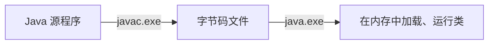
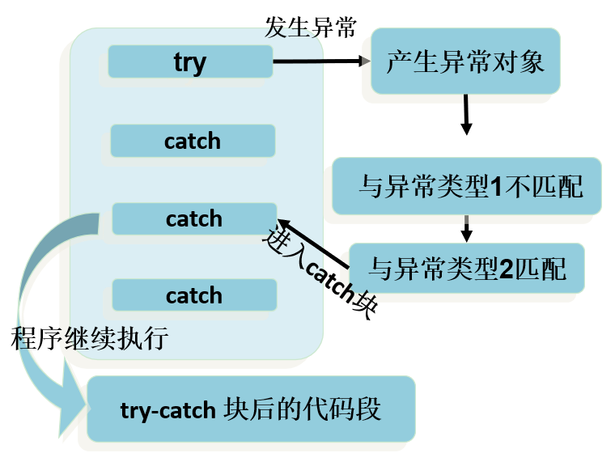
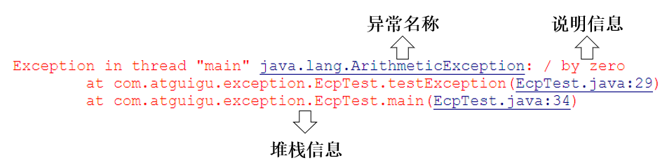

## 1. Java 异常体系

### 1.1 Throwable

`java.lang.Throwable` 类是 Java 程序执行过程中发生的异常事件对应的类的**根父类**。

**常用方法：**

* `public void printStackTrace()`：打印异常的详细信息，包含了异常的类型、原因、出现的位置

* `public String getMessage()`：获取发生异常的原因。

### 1.2 Error 和 Exception

Throwable 可分为两类：Error 和 Exception 。分别对应着`java.lang.Error`与`java.lang.Exception`两个类。

**`Error`：**Java 虚拟机无法解决的严重问题。如：JVM 系统内部错误、资源耗尽等严重情况。**一般不编写针对性的代码进行处理。**

​	例如：StackOverflowError（栈内存溢出）和 OutOfMemoryError（堆内存溢出，简称 OOM）。

**`Exception`:** 其它因编程错误或偶然的外在因素导致的一般性问题，需要使用针对性的代码进行处理，使程序继续运行。

​	例如：空指针访问、试图读取不存在的文件、网络连接中断、数组角标越界。

### 1.3 编译时异常和运行时异常

Java 程序的执行分为编译时过程和运行时过程。



* **编译时期异常**（checked 异常、**受检异常**）：在代码编译阶段，编译器就能明确`警示`当前代码`可能发生`的异常，并`明确督促`程序员提前编写处理它的代码。如果程序员没有编写对应的异常处理代码，则编译器就会`直接判定编译失败`，从而不能生成字节码文件。通常这类异常的发生不是由程序员的代码引起的，或者不是靠加简单判断就可以避免的。
* **运行时期异常**（runtime 异常、unchecked 异常、**非受检异常**）：在代码编译阶段，`编译器完全不做任何检查`，只有等代码`运行`起来并确实发生了异常它才能被发现。通常这类异常是由程序员的代码编写不当引起的。

## 2. 常见的错误和异常

**Java 常见编译时异常 (Checked Exceptions)**

| 异常类名                     | 翻译             | 解释                                                         |
| :--------------------------- | :--------------- | :----------------------------------------------------------- |
| `IOException`                | 输入输出异常     | 当发生输入/输出操作失败或被中断时抛出，例如读写文件失败。    |
| `FileNotFoundException`      | 文件未找到异常   | 当试图打开一个不存在的文件进行读写时抛出，是 `IOException` 的子类。 |
| `SQLException`               | SQL 异常         | 当访问数据库发生错误时抛出，例如 SQL 语法错误、数据库连接失败等。 |
| `ClassNotFoundException`     | 类未找到异常     | 当应用程序试图通过其名称加载类，但无法找到该类的定义时抛出。通常发生在 `Class.forName()` 或类加载器 `loadClass()` 方法中。 |
| `NoSuchMethodException`      | 方法未找到异常   | 当试图访问一个不存在的方法时抛出。通常在反射操作中出现。     |
| `InterruptedException`       | 中断异常         | 当一个线程正在等待、休眠或以其他方式被占用，而另一个线程使用 `interrupt()` 方法中断它时抛出。 |
| `ParseException`             | 解析异常         | 当解析字符串（例如日期、数字）时发生错误，表明字符串格式不符合预期时抛出。例如 `SimpleDateFormat.parse()`。 |
| `CloneNotSupportedException` | 克隆不支持异常   | 当调用 `Object` 类的 `clone()` 方法克隆一个对象，但该对象的类没有实现 `Cloneable` 接口时抛出。 |
| `NoSuchFieldException`       | 字段未找到异常   | 当试图访问一个不存在的字段（成员变量）时抛出。通常在反射操作中出现。 |
| `MalformedURLException`      | URL 格式错误异常 | 当创建一个 URL 对象时，如果指定的字符串不是有效的 URL 格式时抛出。 |

**Java 常见运行时异常 (Unchecked Exceptions / Runtime Exceptions)**

| 异常类名                          | 翻译               | 解释                                                         |
| :-------------------------------- | :----------------- | :----------------------------------------------------------- |
| `NullPointerException`            | 空指针异常         | 当应用程序试图在需要对象的地方使用 `null` 时抛出，例如调用 `null` 对象的方法或访问其字段。 |
| `ArrayIndexOutOfBoundsException`  | 数组索引越界异常   | 当试图访问数组的一个不存在的索引时抛出，即索引为负数或大于等于数组长度。 |
| `ArithmeticException`             | 算术异常           | 当出现异常的算术条件时抛出，例如整数除以零。                 |
| `ClassCastException`              | 类型转换异常       | 当试图将对象强制转换为不是其实例的子类时抛出。               |
| `IllegalArgumentException`        | 非法参数异常       | 当向方法传递了一个不合法或不正确的参数时抛出。               |
| `NumberFormatException`           | 数字格式异常       | 当试图将格式不正确的字符串转换为数字类型时抛出，例如将 "abc" 转换为整数。是 `IllegalArgumentException` 的子类。 |
| `IllegalStateException`           | 非法状态异常       | 当在 Java 环境或应用程序尚未处于某个方法所请求的适当状态时调用该方法时抛出。 |
| `StringIndexOutOfBoundsException` | 字符串索引越界异常 | 当试图访问字符串的一个不存在的索引时抛出，即索引为负数或大于等于字符串长度。是 `IndexOutOfBoundsException` 的子类。 |
| `UnsupportedOperationException`   | 不支持操作异常     | 当对象不支持请求的操作时抛出。例如，对一个不可修改的集合调用 `add()` 或 `remove()` 方法。 |
| `SecurityException`               | 安全异常           | 当安全管理器检测到安全违规时抛出。                           |
| `ConcurrentModificationException` | 并发修改异常       | 当方法检测到对象的并发修改，但这种修改是不允许的时抛出。例如，在使用迭代器遍历集合时，同时通过集合自身的方法修改了集合的结构（添加或删除元素）。 |
| `NegativeArraySizeException`      | 数组大小为负异常   | 当试图创建一个大小为负数的数组时抛出。                       |

### 2.1 Error

最常见的就是`VirtualMachineError`，它有两个经典的子类：`StackOverflowError`、`OutOfMemoryError`。

```java
import org.junit.junitTest;

public class TestStackOverflowError {
    @junitTest
    public void test01(){
        // StackOverflowError
        recursion();
    }

    public void recursion(){ // 递归方法
        recursion(); // 无限递归
    }
}
```

```java
import org.junit.junitTest;

public class TestOutOfMemoryError {
    @junitTest
    public void test02(){
        //OutOfMemoryError
        //方式一：
        int[] arr = new int[Integer.MAX_VALUE];
    }
    @junitTest
    public void test03(){
        //OutOfMemoryError
        //方式二：
        StringBuilder s = new StringBuilder();
        while(true){
            s.append("aaaaa");
        }
    }
}
```

### 2.2 运行时异常

```java
import org.junit.junitTest;
import java.util.Scanner;

public class TestRuntimeException {
    @junitTest
    public void test01(){
        // NullPointerException 空指针引用
        int[][] arr = new int[3][];
        System.out.println(arr[0].length);
    }

    @junitTest
    public void test02(){
        // ClassCastException 类型转换异常
        Object obj = 15; // 会自动装箱成 Integer 对象
        String str = (String) obj; // 在运行时，JVM 会检查 obj 所引用的对象的真实类型，发现它并不是 String
        // 正确做法： String str = obj.toString(); 或 String str = "" + obj;
    }

    @junitTest
    public void test03(){
        // ArrayIndexOutOfBoundsException 数组下标越界
        int[] arr = new int[5];
        for (int i = 1; i <= 5; i++) {
            System.out.println(arr[i]);
        }
    }

    @junitTest
    public void test04(){
        // InputMismatchException 输入类型不匹配
        Scanner input = new Scanner(System.in);
        System.out.print("请输入一个整数："); // 假设输入非整数
        int num = input.nextInt();
        input.close();
    }

    @junitTest
    public void test05(){
        int a = 1;
        int b = 0;
        // ArithmeticException 除数为零
        System.out.println(a/b);
    }
}

```

### 2.3 编译时异常

```java
import org.junit.junitTest;

import java.io.FileInputStream;
import java.io.FileNotFoundException;
import java.sql.Connection;
import java.sql.DriverManager;
import java.sql.SQLException;

public class TestCheckedException {
    @junitTest
    public void test06() {
        Thread.sleep(1000); // InterruptedException 线程被中断
    }

    @junitTest
    public void test07(){
        Class c = Class.forName("java.lang.String"); // ClassNotFoundException 未找到类名 Class
    }

    @junitTest
    public void test08() { 
        Connection conn = DriverManager.getConnection("...."); // SQLException 数据库操作异常
    }
    
    @junitTest
    public void test09()  {
        FileInputStream fis = new FileInputStream("cannotfound.txt"); // FileNotFoundException 未找到文件
    }
    
    @junitTest
    public void test10() {
        File file = new File("cannotfound.txt");
		FileInputStream fis = new FileInputStream(file); // FileNotFoundException
		int b = fis.read(); // IOException IO 异常
		while(b != -1){
			System.out.print((char)b);
			b = fis.read(); // IOException
		}
		
		fis.close(); // IOException
    }
}
```

## 3. 异常的处理

### 3.1 捕获异常（try-catch-finally）

> Java 提供了异常处理的**抓抛模型**。
>
> - 前面提到，Java 程序的执行过程中如出现异常，会生成一个异常类对象，该异常对象将被提交给 Java 运行时系统，这个过程称为`抛出(throw)异常`。
> - 如果一个方法内抛出异常，该异常对象会被抛给调用者方法中处理。如果异常没有在调用者方法中处理，它继续被抛给这个调用方法的上层方法，直到异常被处理。这一过程称为`捕获(catch)异常`。
> - 如果一个异常回到 main() 方法，并且 main() 也不处理，则程序运行终止。

捕获异常语法如下：

~~~java
try{
	......	// 可能产生异常的代码
}
catch( 异常类型 1 e ){
	......	//当产生异常类型 1 型异常时的处置措施
}
catch( 异常类型 2 e ){
	...... 	// 当产生异常类型 2 型异常时的处置措施
}  
finally{
	...... // 无论是否发生异常，都无条件执行的语句
} 
~~~

#### 1. 整体执行过程：

当某段代码可能发生异常，不管这个异常是编译时异常（受检异常）还是运行时异常（非受检异常），我们都可以使用 try 块将它括起来，并在 try 块下面编写 catch 分支尝试捕获对应的异常对象。

- 如果在程序运行时，try 块中的代码没有发生异常，那么 catch 所有的分支都不执行。
- 如果在程序运行时，try 块中的代码发生了异常，根据异常对象的类型，将从上到下选择第一个匹配的 catch 分支执行。此时 try 中发生异常的语句下面的代码将不执行，而整个 try...catch 之后的代码可以继续运行。
- 如果在程序运行时，try 块中的代码发生了异常，但是所有 catch 分支都无法匹配（捕获）这个异常，那么 JVM 将会终止当前方法的执行，并把异常对象“抛”给调用者。如果调用者不处理，程序就挂了。



#### 2. `try`

捕获异常的第一步是用`try{}`选定捕获异常的范围，将可能出现异常的业务逻辑代码放在 try 语句块中。

#### `3. catch (Exceptiontype e)`

**异常类型的选择原则**

- 可以使用**确切的异常类型**作为 catch 参数

- 也可以使用**异常的父类**作为 catch 参数
  
  例如：可以用`ArithmeticException`的地方，也可以用`RuntimeException`或`Exception`

**多个 catch 块的使用**

- 每个 try 语句块可以配合一个或多个 catch 语句

- 多个 catch 块用于处理不同类型的异常对象

- 如果多个异常类型存在父子关系，必须保证：
  
  - 子类异常（更具体的异常）在上面
  - 父类异常（更通用的异常）在下面
  
  违反此规则将导致编译错误。

**常用的异常处理方法**

- `public String getMessage()`  获取异常的描述信息，返回一个描述异常的字符串
- `public void printStackTrace()`  打印异常的跟踪栈信息并输出到控制台，包含异常类型、原因及出现位置。



举例：

```java

@junitTest
public void test1()
{
    try
    {
        String str1 = "atguigu.com";
        str1 = null;
        System.out.println(str1.charAt(0));
    } catch (NullPointerException e)
    {
        // 异常的处理方式 1
        System.out.println("不好意思，亲~出现了小问题，正在加紧解决...");
    } catch (ClassCastException e)
    {
        // 异常的处理方式 2
        System.out.println("出现了类型转换的异常");
    } catch (RuntimeException e)
    {
        // 异常的处理方式 3
        System.out.println("出现了运行时异常");
    }
    // 此处的代码，在异常被处理了以后，是可以正常执行的
    System.out.println("hello");
}
```

#### 4. `finally`

存放无论异常是否发生都`需要执行`的代码。不论在 try 代码块中是否发生了异常事件，catch 语句是否执行，catch 语句是否有异常，catch 语句中是否有 return，finally 块中的语句都会被执行。

例如，数据库连接、输入流输出流、Socket 连接、Lock 锁的关闭等

唯一的例外，使用 System.exit(0) 来终止当前正在运行的 Java 虚拟机。

> finally 语句和 catch 语句是可选的，但 finally 不能单独使用。

举例 1：确保资源关闭

```java
import java.util.InputMismatchException;
import java.util.Scanner;

public class TestFinally
{
    public static void main(String[] args)
    {
        Scanner input = new Scanner(System.in);
        try
        {
            System.out.print("请输入第一个整数：");
            int a = input.nextInt();
            System.out.print("请输入第二个整数：");
            int b = input.nextInt();
            int result = a / b;
            System.out.println(a + "/" + b + "=" + result);
        } catch (InputMismatchException e)
        {
            System.out.println("数字格式不正确，请输入两个整数");
        } catch (ArithmeticException e)
        {
            System.out.println("第二个整数不能为 0");
        } finally
        {
            System.out.println("程序结束，释放资源");
            input.close();
        }
    }

    @junitTest
    public void test1()
    {
        FileInputStream fis = null;
        try
        {
            File file = new File("hello1.txt");
            fis = new FileInputStream(file);// FileNotFoundException
            int b = fis.read();// IOException
            while (b != -1)
            {
                System.out.print((char) b);
                b = fis.read();// IOException
            }

        } catch (IOException e)
        {
            e.printStackTrace();
        } finally
        {
            try
            {
                if (fis != null)
                    fis.close();// IOException
            } catch (IOException e)
            {
                e.printStackTrace();
            }
        }
    }
}
```

举例 2：从 try 回来

```java
public class FinallyTest1 {
    public static void main(String[] args) {
        int result = test("12");
        System.out.println(result);
    }

    public static int test(String str){
        try{
            Integer.parseInt(str);
            return 1;
        }catch(NumberFormatException e){
            return -1;
        }finally{
            System.out.println("test 结束");
        }
    }
}
```

举例 3：从 catch 回来

```java
public class FinallyTest2 {
    public static void main(String[] args) {
        int result = test("a");
        System.out.println(result);
    }

    public static int test(String str) {
        try {
            Integer.parseInt(str);
            return 1;
        } catch (NumberFormatException e) {
            return -1;
        } finally {
            System.out.println("test 结束");
        }
    }
}
```

举例 4：从 finally 回来

```java
public class FinallyTest3 {
    public static void main(String[] args) {
        int result = test("a");
        System.out.println(result);
    }

    public static int test(String str) {
        try {
            Integer.parseInt(str);
            return 1;
        } catch (NumberFormatException e) {
            return -1;
        } finally {
            System.out.println("test 结束");
            return 0;
        }
    }
}
```

### 3.2 声明抛出异常类型（throws）

如果在编写方法体的代码时，某句代码可能发生某个`编译时异常`，不处理编译不通过，但是在当前方法体中可能`不适合处理`或`无法给出合理的处理方式`，则此方法应`显式地`声明抛出异常，表明该方法将不对这些异常进行处理，而由该方法的调用者负责处理。

**声明异常格式：**

~~~
修饰符 返回值类型 方法名(参数) throws 异常类名 1,异常类名 2… {   }	
~~~

在 throws 后面可以写多个异常类型，用逗号隔开。

```java
public void readFile(String file)  throws FileNotFoundException,IOException {
	...
	// 读文件的操作可能产生 FileNotFoundException 或 IOException 类型的异常
	FileInputStream fis = new FileInputStream(file);
    //...
}
```

**举例：针对于编译时异常**

```java
public class TestThrowsCheckedException {
    public static void main(String[] args) {
        System.out.println("上课.....");
        try {
            afterClass();// 换到这里处理异常
        } catch (InterruptedException e) {
            e.printStackTrace();
            System.out.println("准备提前上课");
        }
        System.out.println("上课.....");
    }

    public static void afterClass() throws InterruptedException {
        for(int i=10; i>=1; i--){
            Thread.sleep(1000);// 本来应该在这里处理异常
            System.out.println("距离上课还有：" + i + "分钟");
        }
    }
}
```

**举例：针对于运行时异常：**

throws 后面也可以写运行时异常类型，只是运行时异常类型，写或不写对于编译器和程序执行来说都没有任何区别。如果写了，唯一的区别就是调用者调用该方法后，使用 try...catch 结构时，IDEA 可以获得更多的信息，需要添加哪种 catch 分支。

~~~java
import java.util.InputMismatchException;
import java.util.Scanner;

public class TestThrowsRuntimeException {
    public static void main(String[] args) {
        Scanner input = new Scanner(System.in);
        try {
            System.out.print("请输入第一个整数：");
            int a = input.nextInt();
            System.out.print("请输入第二个整数：");
            int b = input.nextInt();
            int result = divide(a,b);
            System.out.println(a + "/" + b +"=" + result);
        } catch (ArithmeticException | InputMismatchException e) {
            e.printStackTrace();
        } finally {
            input.close();
        }
    }

    public static int divide(int a, int b)throws ArithmeticException{
        return a/b;
    }
}
~~~

**方法重写中 throws 的要求**

1. 方法名必须相同
2. 形参列表必须相同
3. 返回值类型
4. 基本数据类型和 void：必须相同
5. 引用数据类型：<=
6. 权限修饰符：>=，而且要求父类被重写方法在子类中是可见的
7. 不能是 static，final 修饰的方法

此外，对于 throws 异常列表要求：

- 如果父类被重写方法的方法签名后面没有 “`throws 编译时异常类型`”，那么重写方法时，方法签名后面也不能出现“`throws 编译时异常类型`”。
- 如果父类被重写方法的方法签名后面有 “`throws 编译时异常类型`”，那么重写方法时，throws 的编译时异常类型必须 <= 被重写方法 throws 的编译时异常类型，或者不 throws 编译时异常。
- 方法重写，对于“`throws 运行时异常类型`”没有要求。

```java
import java.io.IOException;

class Father{
    public void method()throws Exception{
        System.out.println("Father.method");
    }
}
class Son extends Father{
    @Override
    public void method() throws IOException,ClassCastException {
        System.out.println("Son.method");
    }
}
```

### 3.3 两种异常处理方式的选择

前提：此时的异常，主要指的是编译时异常。

- 如果程序代码中，涉及到资源的调用（流、数据库连接、网络连接等），则必须考虑使用`try-catch-finally`来处理，保证不出现内存泄漏。
- 如果父类被重写的方法没有`throws`异常类型，则子类重写的方法中如果出现异常，只能考虑使用`try-catch-finally`进行处理，不能`throws`。
- 开发中，方法 a 中依次调用了方法 b,c,d 等方法，方法 b,c,d 之间是递进关系。此时，如果方法 b,c,d 中有异常，我们通常选择使用 throws，而方法 a 中通常选择使用`try-catch-finally`。

## 4. 手动抛出异常对象：`throw`

**异常对象的生成方式**

Java 中的异常对象可以通过以下两种方式产生：

- **虚拟机自动生成**：在程序运行期间，当 JVM 检测到程序出现问题时，它会在后台自动创建一个与该问题对应的异常类的实例对象，并将其抛出。
- **开发人员手动创建并抛出**：开发人员可以使用 `new` 关键字显式创建异常对象，然后使用 `throw` 关键字将这个创建的异常对象抛出：

```java
throw new 异常类名(参数);
```

被 `throw` 语句抛出的对象**必须是 `Throwable` 类或其子类的实例**。尝试抛出非 `Throwable` 类型的对象会导致编译时语法错误。例如，以下代码是错误的：

```java
throw new String("want to throw"); // 编译错误
```

通过 `throw` 语句手动抛出的异常对象，与 JVM 自动创建和抛出的异常对象在行为和处理机制上是相同的。

**抛出异常的后果与处理**

1.  **改变程序执行流程**：

    *   `throw` 语句会立即中断正常的程序执行流程。
    *   `throw` 语句**之后的代码将不会被执行**。

2.  **方法终止与异常返回**：

    *   如果当前方法内没有使用 `try...catch` 结构来捕获并处理这个被抛出的异常对象：
        *   `throw` 语句会**代替 `return` 语句**，提前终止当前方法的执行。
        *   该异常对象会返回给当前方法的调用者（上一级方法）。

3.  **异常的强制处理（编译时异常）**：

    *   如果手动抛出的是**编译时异常**，那么必须：
        *   在当前方法签名中使用 `throws` 关键字声明该异常，将处理责任交给调用者。
        *   或者，在当前方法内部使用 `try-catch` 块来捕获并处理该异常。
    *   否则，程序将无法通过编译。

4.  **异常的可选处理（运行时异常）**：

    *   如果手动抛出的是**运行时异常**，编译器不会强制要求使用 `throws` 声明或 `try-catch` 处理。
    *   然而，这并不意味着可以忽略它们。

5.  **未处理异常的最终结果**：

    无论是编译时异常还是运行时异常，如果最终没有在任何层级的调用栈中被 `try...catch` 合理地处理，都会导致程序在该异常抛出点终止执行（即程序崩溃），并在控制台打印异常信息。

~~~java
public class TestThrow {
    public static void main(String[] args) {
        try {
            System.out.println(max(4,2,31,1));
        } catch (Exception e) {
            e.printStackTrace();
        }
        try {
            System.out.println(max(4));
        } catch (Exception e) {
            e.printStackTrace();
        }
        try {
            System.out.println(max());
        } catch (Exception e) {
            e.printStackTrace();
        }
    }

    public static int max(int... nums){
        if(nums == null || nums.length==0){
            throw new IllegalArgumentException("没有传入任何整数，无法获取最大值");
        }
        int max = nums[0];
        for (int i = 1; i < nums.length; i++) {
            if(nums[i] > max){
                max = nums[i];
            }
        }
        return max;
    }
}
~~~

## 5. 自定义异常

有些异常情况是核心类库中没有定义好的，此时我们需要根据自己业务的异常情况来定义异常类。

- 要继承一个异常类型

  自定义一个编译时异常类型：继承`java.lang.Exception`。

  自定义一个运行时异常类型：继承`java.lang.RuntimeException`。

- 提供至少两个构造器，一个是无参构造，一个是(String message)构造器。

- 提供`serialVersionUID`

**注意：**

1. 自定义的异常只能通过`throw`手动抛出。抛出后由`try...catch`处理，也可以`throws`给调用者处理。
2. 自定义异常最重要的是异常类的名字和 message 属性。当异常出现时，可以根据名字判断异常类型。

举例 1：

```java
class MyException extends Exception {
    static final long serialVersionUID = 23423423435L;
    private int idnumber;

    public MyException(String message, int id) {
        super(message);
        this.idnumber = id;
    }

    public int getId() {
        return idnumber;
    }
}
```

```java
public class MyExpTest {
    public void regist(int num) throws MyException {
        if (num < 0)
            throw new MyException("人数为负值，不合理", 3);
        else
            System.out.println("登记人数" + num);
    }
    public void manager() {
        try {
            regist(100);
        } catch (MyException e) {
            System.out.print("登记失败，出错种类" + e.getId());
        }
        System.out.print("本次登记操作结束");
    }
    public static void main(String args[]) {
        MyExpTest t = new MyExpTest();
        t.manager();
    }
}
```

举例 2：

~~~java
//自定义异常：
public class NotTriangleException extends Exception{
    static final long serialVersionUID = 13465653435L;

    public NotTriangleException() {
    }

    public NotTriangleException(String message) {
        super(message);
    }
}
~~~

```java
public class Triangle {
    private double a;
    private double b;
    private double c;

    public Triangle(double a, double b, double c) throws NotTriangleException {
        if(a<=0 || b<=0 || c<=0){
            throw new NotTriangleException("三角形的边长必须是正数");
        }
        if(a+b<=c || b+c<=a || a+c<=b){
            throw new NotTriangleException(a+"," + b +"," + c +"不能构造三角形，三角形任意两边之后必须大于第三边");
        }
        this.a = a;
        this.b = b;
        this.c = c;
    }

    public double getA() {
        return a;
    }

    public void setA(double a) throws NotTriangleException{
        if(a<=0){
            throw new NotTriangleException("三角形的边长必须是正数");
        }
        if(a+b<=c || b+c<=a || a+c<=b){
            throw new NotTriangleException(a+"," + b +"," + c +"不能构造三角形，三角形任意两边之后必须大于第三边");
        }
        this.a = a;
    }

    public double getB() {
        return b;
    }

    public void setB(double b) throws NotTriangleException {
        if(b<=0){
            throw new NotTriangleException("三角形的边长必须是正数");
        }
        if(a+b<=c || b+c<=a || a+c<=b){
            throw new NotTriangleException(a+"," + b +"," + c +"不能构造三角形，三角形任意两边之后必须大于第三边");
        }
        this.b = b;
    }

    public double getC() {
        return c;
    }

    public void setC(double c) throws NotTriangleException {
        if(c<=0){
            throw new NotTriangleException("三角形的边长必须是正数");
        }
        if(a+b<=c || b+c<=a || a+c<=b){
            throw new NotTriangleException(a+"," + b +"," + c +"不能构造三角形，三角形任意两边之后必须大于第三边");
        }
        this.c = c;
    }

    @Override
    public String toString() {
        return "Triangle{" +
                "a=" + a +
                ", b=" + b +
                ", c=" + c +
                '}';
    }
}
```

```java
public class TestTriangle {
    public static void main(String[] args) {
        Triangle t = null;
        try {
            t = new Triangle(2,2,3);
            System.out.println("三角形创建成功：");
            System.out.println(t);
        } catch (NotTriangleException e) {
            System.err.println("三角形创建失败");
            e.printStackTrace();
        }

        try {
            if(t != null) {
                t.setA(1);
            }
            System.out.println("三角形边长修改成功");
        } catch (NotTriangleException e) {
            System.out.println("三角形边长修改失败");
            e.printStackTrace();
        }
    }
}
```