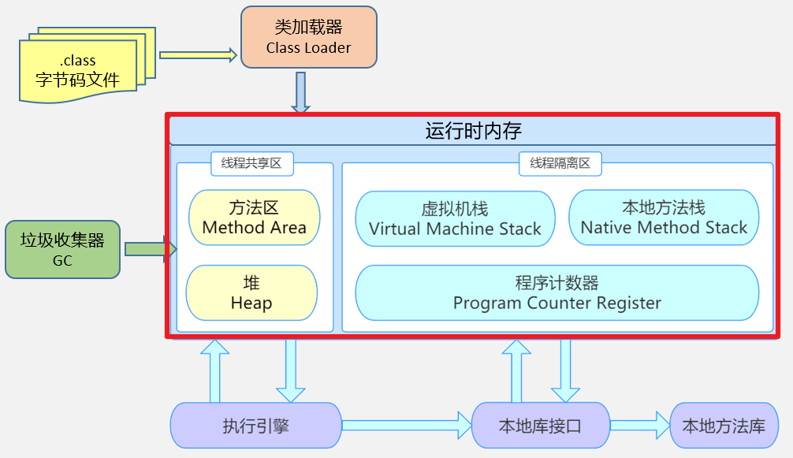

## 1. 相关概念

### 1.1 程序、进程与线程

* **程序（program）**：为完成特定任务，用某种语言编写的`一组指令的有序集合`。即指`一段静态的代码`。

* **进程（process）**：程序的一次执行过程，或是正在内存中运行的应用程序。

  - 进程是`操作系统进行资源分配和调度的基本单位`，系统在运行时会为每个进程分配不同的内存区域。

  - 每个进程都有一个独立的内存空间，系统运行一个程序即是一个进程从创建、运行到消亡的过程。（生命周期）

  - 程序是静态的，进程是动态的。一个程序可以对应多个进程

* **线程（thread）**：线程是进程的一个实体，是 `CPU 调度和分派的基本单位`，比进程更小，能独立运行。

  - 一个进程同一时间若`并行`执行多个线程，就是支持多线程的。
- 一个进程中的多个线程共享相同的内存单元，它们从同一个堆中分配对象，可以访问相同的变量和对象。这就使得线程间通信更简便、高效。但多个线程操作共享的系统资源可能就会带来`安全的隐患`。
  
> 不同的进程之间是不共享内存的。进程之间的数据交换和通信的成本很高。
  >



### 1.2 线程调度

- **分时调度**

  所有线程`轮流使用` CPU 的使用权，并且平均分配每个线程占用 CPU 的时间。

- **抢占式调度**

  让`优先级高`的线程以`较大的概率`优先使用 CPU。如果线程的优先级相同，那么会随机选择一个(线程随机性)。Java使用的为抢占式调度。


### 1.3 并行与并发

- **并行 (Parallelism):** 在同一时刻，多个任务真正地同时执行。这通常需要多个处理核心 (多核 CPU) 或者多个计算节点 (分布式系统)。`并行`强调的是任务的实际执行，多个任务在微观上也是同时进行的。

  例如，多核 CPU 上运行多个线程，每个核心负责执行一个线程，这些线程真正地同时运行。

- **并发 (Concurrency):** 在一段时间内，多个任务都在执行。这些任务可能会交替执行，也可能在不同的时间段执行。并发强调的是任务的调度和切换，多个任务在宏观上看起来是同时进行的，但在微观上可能是交替执行的。

  例如，单核 CPU 上运行多个线程，操作系统会快速切换这些线程，使得用户感觉多个线程在同时运行。

好的，我已经将您提供的关于 JDK 5.0 新增线程创建方式的笔记，整合到现有的“创建和启动线程”的笔记中。按照您的要求，我对内容进行了精简和重组，删除了图片引用，并调整了示例代码。

以下是整理后的 Markdown 笔记：

## 2. 创建和启动线程

### 2.1 概述

Java 语言的 JVM 允许程序运行多个线程，使用 `java.lang.Thread` 类代表**线程**，所有的线程对象都必须是 Thread 类或其子类的实例。

*   每个线程都是通过某个特定 Thread 对象的 `run()` 方法来完成操作的，因此把 `run()` 方法体称为`线程执行体`。
*   通过该 Thread 对象的 `start()` 方法来启动这个线程，而非直接调用 `run()`。
*   要想实现多线程，必须在主线程中创建新的线程对象。

### 2.2 方式1：继承Thread类

可以通过继承 `Thread` 类并重写其 `run()` 方法来定义一个线程。

**步骤：**

1.  定义 `Thread` 类的子类，并重写该类的 `run()` 方法，该 `run()` 方法的方法体就代表了线程需要完成的任务。
2.  创建 `Thread` 子类的实例，即创建了线程对象。
3.  调用线程对象的 `start()` 方法来启动该线程。

**示例代码：**
```java
// 1. 自定义线程类继承 Thread
class MyThread extends Thread {
    // 定义指定线程名称的构造方法
    public MyThread(String name) {
        super(name); // 调用父类的String参数的构造方法，指定线程的名称
    }

    // 2. 重写 run 方法，定义线程执行逻辑
    @Override
    public void run() {
        for (int i = 0; i < 5; i++) { // 简化循环次数
            System.out.println(getName() + "：正在执行！" + i);
        }
    }
}

public class TestMyThread {
    public static void main(String[] args) {
        // 3. 创建自定义线程对象
        MyThread mt1 = new MyThread("子线程1");
        // 4. 启动线程
        mt1.start();

        MyThread mt2 = new MyThread("子线程2");
        mt2.start();

        for (int i = 0; i < 5; i++) {
            System.out.println("main线程！" + i);
        }
    }
}
```

> **注意：**
>
> 1.  如果自己手动调用 `run()` 方法，那么就只是普通方法调用，没有启动多线程模式。
> 2.  `run()` 方法由 JVM 在新线程中调用，其执行时机由操作系统CPU调度决定。
> 3.  必须调用 `start()` 方法才能启动多线程。
> 4.  一个线程对象只能调用一次 `start()` 方法，重复调用会抛出 `IllegalThreadStateException`。

### 2.3 方式2：实现Runnable接口

通过实现 `Runnable` 接口并将任务逻辑放在 `run()` 方法中，然后将 `Runnable` 对象传递给 `Thread` 对象来创建线程。

**步骤：**

1.  定义一个实现 `Runnable` 接口的类，并重写其 `run()` 方法。
2.  创建 `Runnable` 实现类的对象。
3.  创建 `Thread` 对象，并将 `Runnable` 实现类的对象作为参数传递给 `Thread` 的构造器。
4.  调用 `Thread` 对象的 `start()` 方法启动线程。

**示例代码：**
```java
// 1. 定义实现 Runnable 接口的类
class MyRunnable implements Runnable {
    @Override
    public void run() {
        // 线程要执行的任务
        for (int i = 0; i < 5; i++) { // 简化循环
            System.out.println(Thread.currentThread().getName() + "：正在执行！" + i);
        }
    }
}

public class RunnableDemo {
    public static void main(String[] args) {
        // 2. 创建 Runnable 实现类的对象
        MyRunnable myRunnable = new MyRunnable();

        // 3. 创建 Thread 对象，并传入 Runnable 对象
        Thread thread1 = new Thread(myRunnable, "线程A"); // 指定线程名
        Thread thread2 = new Thread(myRunnable, "线程B");

        // 4. 启动线程
        thread1.start();
        thread2.start();
    }
}
```

> **注意：**
>
> 1.  调用 `run()` 只是在当前线程里执行方法体，不会启动新线程。必须调用 `start()`。实际的线程对象依然是 `Thread` 实例，该 `Thread` 线程负责执行其 `target`（即传入的 `Runnable` 对象）的 `run()` 方法。
> 2.  `Runnable` 对象可以被多个 `Thread` 对象共享，这适合多个线程处理同一份资源的情况。但也可能因此引发线程安全问题，需要额外注意。

### 2.4 变形写法

可以使用匿名内部类来快速创建和启动线程。

**基于继承 `Thread` 的匿名内部类：**
```java
new Thread("匿名子线程") { // 直接指定线程名
    @Override
    public void run() {
        for (int i = 0; i < 5; i++) {
            System.out.println(getName() + "：正在执行！" + i);
        }
    }
}.start();
```

**基于实现 `Runnable` 的匿名内部类：**
```java
new Thread(new Runnable() {
    @Override
    public void run() {
        for (int i = 0; i < 5; i++) {
            System.out.println(Thread.currentThread().getName() + "：正在执行！" + i);
        }
    }
}, "匿名Runnable线程").start(); // 指定线程名
```

### 2.5 方式3：实现`Callable`接口 (JDK 5.0 新增)

与 `Runnable` 相比，`Callable` 接口功能更强大，它允许 `call()` 方法返回一个结果，并且可以抛出受检查的异常。

*   `call()` 方法可以有返回值。
*   `call()` 方法可以声明抛出异常。
*   支持泛型返回值。

**`Future` 和 `FutureTask`：**

*   `Future` 接口：代表异步计算的结果。可以用来检查计算是否完成、等待计算完成并获取其结果，或者取消计算。
*   `FutureTask` 类：是 `Future` 接口的一个实现，它同时实现了 `Runnable` 接口。因此，`FutureTask` 对象既可以作为 `Runnable` 被线程执行，又可以作为 `Future` 来获取 `Callable` 的返回值。

**步骤：**
1.  创建一个实现 `Callable` 接口的类，并重写 `call()` 方法。
2.  创建 `Callable` 实现类的对象。
3.  使用 `FutureTask` 类包装 `Callable` 对象。
4.  创建 `Thread` 对象，将 `FutureTask` 对象作为参数传递，并调用 `start()` 方法。
5.  通过 `FutureTask` 对象的 `get()` 方法获取线程执行的返回值（此方法会阻塞当前线程直到结果可用）。

**示例代码：**
```java
import java.util.concurrent.Callable;
import java.util.concurrent.FutureTask;
import java.util.concurrent.ExecutionException;

// 1. 创建一个实现 Callable 的实现类
class MyCallable implements Callable<Integer> { // 使用泛型指定返回值类型
    // 2. 实现 call 方法，定义线程执行的操作并返回结果
    @Override
    public Integer call() throws Exception {
        int sum = 0;
        for (int i = 1; i <= 20; i++) { // 简化计算
            sum += i;
        }
        System.out.println(Thread.currentThread().getName() + "：计算完成。");
        return sum;
    }
}

public class CallableTest {
    public static void main(String[] args) {
        // 3. 创建 Callable 接口实现类的对象
        MyCallable myCallable = new MyCallable();

        // 4. 将 Callable 实现类对象作为参数传递到 FutureTask 构造器中，创建 FutureTask 对象
        FutureTask<Integer> futureTask = new FutureTask<>(myCallable);

        // 5. 将 FutureTask 对象作为参数传递到 Thread 类的构造器中，创建 Thread 对象，并调用 start()
        new Thread(futureTask, "Callable线程").start();

        try {
            // 6. 获取 Callable 中 call 方法的返回值
            // get() 方法会阻塞当前线程，直到 call() 方法执行完毕返回结果
            Integer sum = futureTask.get();
            System.out.println("总和为：" + sum);
        } catch (InterruptedException e) {
            // 当前线程在等待期间被中断
            e.printStackTrace();
        } catch (ExecutionException e) {
            // 计算任务抛出异常
            e.printStackTrace();
        }
        System.out.println("主线程执行完毕。");
    }
}
```
**缺点：** 在获取分线程执行结果时（调用 `futureTask.get()`），当前线程（如主线程）会受阻塞，可能降低程序并发效率。

### 2.6 方式4：使用线程池 (JDK 5.0 新增)

如果并发线程数量很多，且每个线程执行时间很短，频繁创建和销毁线程会消耗大量系统资源，降低效率。线程池通过复用已创建的线程来解决此问题。

**核心思想：**
提前创建若干线程放入池中，使用时直接从池中获取，使用完毕后归还池中，实现线程的重复利用。

**好处：**

*   **提高响应速度**：减少了创建新线程的时间。
*   **降低资源消耗**：复用线程，避免频繁创建和销毁。
*   **便于线程管理**：可以统一管理线程的创建、销毁、数量等（如核心池大小 `corePoolSize`、最大线程数 `maximumPoolSize`、空闲线程存活时间 `keepAliveTime` 等）。

**相关API：**
Java 在 `java.util.concurrent` 包下提供了线程池相关的 API。

*   **`ExecutorService` 接口**：代表线程池，是线程池的核心接口。其常用实现类是 `ThreadPoolExecutor`。
    
    | 方法                                     | 参数说明                 | 描述                                                         |
    | :--------------------------------------- | :----------------------- | :----------------------------------------------------------- |
    | `void execute(Runnable command)`         | `Runnable` 类型的任务    | 执行一个实现了 `Runnable` 接口的任务，该方法没有返回值。     |
    | `<T> Future<T> submit(Callable<T> task)` | `Callable<T>` 类型的任务 | 提交一个实现了 `Callable` 接口的任务，返回一个 `Future` 对象用于获取结果。 |
    | `Future<?> submit(Runnable task)`        | `Runnable` 类型的任务    | 提交一个 `Runnable` 任务，返回一个 `Future` 对象（其 `get()` 方法在成功完成后返回 `null`）。 |
    | `void shutdown()`                        | 无                       | 平缓关闭线程池：不再接受新任务，但会执行完已提交的任务。     |
    | `List<Runnable> shutdownNow()`           | 无                       | 立即关闭线程池：尝试停止所有正在执行的任务，并返回等待执行的任务列表。 |
    
*   **`Executors` 类**：一个线程池的工厂类，提供了创建不同类型线程池的静态方法。
    *   `Executors.newFixedThreadPool(int nThreads)`: 创建一个固定大小的线程池。
    *   `Executors.newCachedThreadPool()`: 创建一个可缓存的线程池，线程数量根据需要动态调整。
    *   `Executors.newSingleThreadExecutor()`: 创建一个只包含一个线程的线程池。
    *   `Executors.newScheduledThreadPool(int corePoolSize)`: 创建一个支持定时及周期性任务执行的线程池。

**示例代码：**
```java
import java.util.concurrent.ExecutorService;
import java.util.concurrent.Executors;
import java.util.concurrent.Callable;
import java.util.concurrent.Future;
import java.util.concurrent.ExecutionException;

// Runnable 任务
class MyRunnableTask implements Runnable {
    private int taskId;
    public MyRunnableTask(int taskId) { this.taskId = taskId; }
    @Override
    public void run() {
        System.out.println(Thread.currentThread().getName() + " 正在执行 Runnable 任务：" + taskId);
        try { Thread.sleep(100); } catch (InterruptedException e) { e.printStackTrace(); } // 模拟耗时
    }
}

// Callable 任务
class MyCallableTask implements Callable<String> {
    private int taskId;
    public MyCallableTask(int taskId) { this.taskId = taskId; }
    @Override
    public String call() throws Exception {
        System.out.println(Thread.currentThread().getName() + " 正在执行 Callable 任务：" + taskId);
        Thread.sleep(100); // 模拟耗时
        return "Callable 任务 " + taskId + " 执行完毕";
    }
}

public class ThreadPoolTest {
    public static void main(String[] args) {
        // 1. 创建线程池 (例如，固定大小为2的线程池)
        ExecutorService executorService = Executors.newFixedThreadPool(2);

        // 2. 执行 Runnable 任务
        executorService.execute(new MyRunnableTask(1)); // 提交任务1
        executorService.execute(new MyRunnableTask(2)); // 提交任务2

        // 3. 提交 Callable 任务并获取结果
        Future<String> future = executorService.submit(new MyCallableTask(3)); // 提交任务3
        try {
            String result = future.get(); // 等待任务3完成并获取结果
            System.out.println("任务3的结果：" + result);
        } catch (InterruptedException | ExecutionException e) {
            e.printStackTrace();
        }

        // 4. 关闭线程池
        // shutdown() 不会立即终止线程池，而是不再接受新任务，并等待已提交任务执行完成
        executorService.shutdown();
        System.out.println("线程池已发出关闭指令。");
    }
}
```

### 2.7 对比创建方式

| 特性               | 继承 `Thread` 类                   | 实现 `Runnable` 接口                         | 实现 `Callable` 接口 (JDK 5.0+)                  | 使用线程池 (JDK 5.0+)                              |
| :----------------- | :--------------------------------- | :------------------------------------------- | :----------------------------------------------- | :------------------------------------------------- |
| **代码与数据耦合** | 耦合（任务逻辑在Thread子类中）     | 解耦（任务逻辑与线程对象分离）               | 解耦（任务逻辑与线程对象分离）                   | 任务与线程创建/管理分离，高度解耦                  |
| **Java单继承限制** | 受单继承限制                       | 不受影响，类可继承其他类                     | 不受影响，类可继承其他类                         | 任务类不受影响                                     |
| **资源共享**       | 不易共享（需将资源设为静态或传入） | 方便共享（多个Thread可共享一个Runnable实例） | 方便共享（多个FutureTask可共享一个Callable实例） | 线程池本身管理线程，任务对象可设计为共享或不共享   |
| **返回值**         | `run()`方法无返回值                | `run()`方法无返回值                          | `call()`方法可有返回值 (通过`Future`获取)        | 提交`Callable`任务可获取返回值                     |
| **异常处理**       | `run()`方法不能抛出受检查异常      | `run()`方法不能抛出受检查异常                | `call()`方法可抛出异常 (通过`Future`捕获)        | `Callable`任务的异常可通过`Future`捕获             |
| **线程管理**       | 手动创建和管理                     | 手动创建和管理                               | 手动创建和管理（通常结合`FutureTask`和`Thread`） | 统一管理线程生命周期、复用线程，性能更优           |
| **适用场景**       | 简单场景，任务与线程紧密相关       | 推荐，任务可复用，资源易共享                 | 需要任务返回值或需抛出异常的场景                 | 大量短生命周期任务，需要控制并发数、提高性能的场景 |

> **总结：**
> *   实现 `Runnable` 和 `Callable` 接口的方式通常优于继承 `Thread` 类，因为它们更灵活，支持代码解耦和资源共享。
> *   `Callable` 相比 `Runnable` 提供了获取任务执行结果和抛出异常的能力。
> *   线程池是管理和复用线程的最佳实践，尤其适用于需要处理大量并发任务的服务器端应用。它能显著提高性能并简化线程管理。

## 3. Thread类的常用结构

### 3.1 构造器

| 构造器                                        | 说明                                                         |
| :-------------------------------------------- | :----------------------------------------------------------- |
| `public Thread()`                             | 分配一个新的线程对象。                                       |
| `public Thread(String name)`                  | 分配一个指定名字的新的线程对象。                             |
| `public Thread(Runnable target)`              | 指定创建线程的目标对象，它实现了`Runnable`接口中的`run`方法。 |
| `public Thread(Runnable target, String name)` | 分配一个带有指定目标新的线程对象并指定名字。                 |

### 3.2 常用方法

| 方法                                             | 参数                                                         | 说明                                                         |
| :----------------------------------------------- | :----------------------------------------------------------- | :----------------------------------------------------------- |
| `public void run()`                              | -                                                            | 此线程执行的任务代码在此定义。                               |
| `public void start()`                            | -                                                            | 启动此线程，Java虚拟机会调用此线程的`run`方法。              |
| `public String getName()`                        | -                                                            | 获取当前线程名称。                                           |
| `public void setName(String name)`               | `String name`：新的线程名称                                  | 设置该线程名称。                                             |
| `public static Thread currentThread()`           | -                                                            | 返回对当前正在执行的线程对象的引用。                         |
| `public static void sleep(long millis)`          | `long millis`：暂停的毫秒数                                  | 使当前正在执行的线程以指定的毫秒数暂停。                     |
| `public static void yield()`                     | -                                                            | 暂停当前线程，让系统的线程调度器重新调度。不保证其他线程一定能获得执行机会。 |
| `public final boolean isAlive()`                 | -                                                            | 测试线程是否处于活动状态（已启动且尚未终止）。               |
| `void join()`                                    | -                                                            | 等待该线程终止。                                             |
| `void join(long millis)`                         | `long millis`：最长等待毫秒数                                | 等待该线程终止的时间最长为 `millis` 毫秒。                   |
| `void join(long millis, int nanos)`              | `long millis`：最长等待毫秒数<br>`int nanos`：额外等待的纳秒数 | 等待该线程终止的时间最长为 `millis` 毫秒 + `nanos` 纳秒。    |
| `public final void stop()`                       | -                                                            | `已过时`。强行结束线程，可能导致清理工作未完成和数据不一致。 |
| `void suspend()` / `void resume()`               | -                                                            | `已过时`。暂停和恢复线程，易发生死锁，因为`suspend()`不释放锁。 |
| `public final int getPriority()`                 | -                                                            | 返回线程优先级。                                             |
| `public final void setPriority(int newPriority)` | `int newPriority`：新的优先级(1-10)                          | 改变线程的优先级。                                           |

**线程优先级常量：**

*   `Thread.MAX_PRIORITY` (10)：最高优先级
*   `Thread.MIN_PRIORITY` (1)：最低优先级
*   `Thread.NORM_PRIORITY` (5)：普通优先级（默认）

**示例：获取和设置线程优先级**

```java
public class PriorityExample {
    public static void main(String[] args) {
        Thread t = new Thread(() -> { // 使用Lambda表达式简化
            System.out.println(Thread.currentThread().getName() + " 的优先级：" + Thread.currentThread().getPriority());
        }, "子线程");
        t.setPriority(Thread.MAX_PRIORITY);
        t.start();

        System.out.println(Thread.currentThread().getName() + " 的优先级：" + Thread.currentThread().getPriority());
    }
}
```

### 3.3 守护线程

守护线程是在后台运行，为其他（非守护）线程提供服务的线程。如果所有非守护线程都死亡，守护线程会自动死亡。

*   `setDaemon(true)`: 将线程设置为守护线程（必须在`start()`之前调用）。
*   `isDaemon()`: 判断线程是否为守护线程。

```java
class MyDaemon extends Thread {
    public void run() {
        while (true) {
            System.out.println("守护线程运行中...");
            try {
                Thread.sleep(100); // 稍微延长睡眠时间，减少控制台输出
            } catch (InterruptedException e) {
                e.printStackTrace();
            }
        }
    }
}

public class TestDaemonThread {
    public static void main(String[] args) {
        MyDaemon daemonThread = new MyDaemon();
        daemonThread.setDaemon(true); // 设置为守护线程
        daemonThread.start();

        for (int i = 1; i <= 10; i++) { // 缩短循环次数
            System.out.println("main线程: " + i);
            try {
                Thread.sleep(50);
            } catch (InterruptedException e) {
                e.printStackTrace();
            }
        }
        System.out.println("main线程结束，守护线程随之结束。");
    }
}
```

## 4. 多线程的生命周期

### 4.1 5种状态(JDK1.5之前)

1.  **新建 (New)**：创建`Thread`对象后，调用`start()`前。
2.  **就绪 (Runnable)**：调用`start()`后，等待CPU调度。
3.  **运行 (Running)**：获得CPU资源，执行`run()`方法。
4.  **阻塞 (Blocked)**：因`sleep()`, `wait()`, I/O操作等原因暂时停止执行，让出CPU。
5.  **死亡 (Dead)**：`run()`方法执行完成、抛出未捕获异常或调用`stop()`（已过时）。

### 4.2 6种状态 (JDK1.5及之后)

**`java.lang.Thread.State` 枚举**

1.  **`NEW` (新建)**：线程已创建但未启动。
2.  **`RUNNABLE` (可运行)**：包括了传统意义上的“就绪”和“运行”状态。线程在JVM中等待操作系统调度或正在运行。
3.  **`BLOCKED` (锁阻塞)**：线程等待获取监视器锁（例如，进入`synchronized`代码块/方法）。
4.  **`WAITING` (无限等待)**：线程无限期等待另一个线程执行特定动作。
    *   因调用 `Object.wait()` (无超时), `Thread.join()` (无超时), `LockSupport.park()` 而进入。
    *   需由 `Object.notify()`/`notifyAll()`, 目标`join`线程结束, `LockSupport.unpark()` 唤醒。
5.  **`TIMED_WAITING` (计时等待)**：线程在指定时间内等待另一个线程执行特定动作。
    *   因调用 `Thread.sleep(long)`, `Object.wait(long)`, `Thread.join(long)`, `LockSupport.parkNanos()`, `LockSupport.parkUntil()` 而进入。
    *   时间到期或被提前唤醒后恢复。
6.  **`TERMINATED` (被终止)**：线程执行完毕。

> **注意**：从`WAITING`或`TIMED_WAITING`恢复到`RUNNABLE`时，若需获取锁而锁不可用，会转入`BLOCKED`状态。

```java
class SubThread extends Thread {
    @Override
    public void run() {
        try {
            Thread.sleep(2000); // 模拟工作
        } catch (InterruptedException e) {
            Thread.currentThread().interrupt(); // 重置中断状态
            e.printStackTrace();
        }
        System.out.println(getName() + " 工作完成。");
    }
}

public class ThreadStateTest {
    public static void main(String[] args) throws InterruptedException {
        SubThread t = new SubThread();
        t.setName("子线程A");
        System.out.println(t.getName() + " 初始状态: " + t.getState()); // NEW

        t.start();
        System.out.println(t.getName() + " 调用start()后状态: " + t.getState()); // RUNNABLE (可能很快变化)

        while (t.isAlive()) { // 使用isAlive()判断，getState()可能在TERMINATED前短暂为RUNNABLE
            System.out.println(t.getName() + " 活动时状态: " + t.getState()); // TIMED_WAITING (因sleep) 或 RUNNABLE
            Thread.sleep(500);
        }
        // 确保线程结束后再获取最终状态
        // t.join(); // 可以选择join来确保线程执行完毕
        System.out.println(t.getName() + " 最终状态: " + t.getState()); // TERMINATED
    }
}
```
