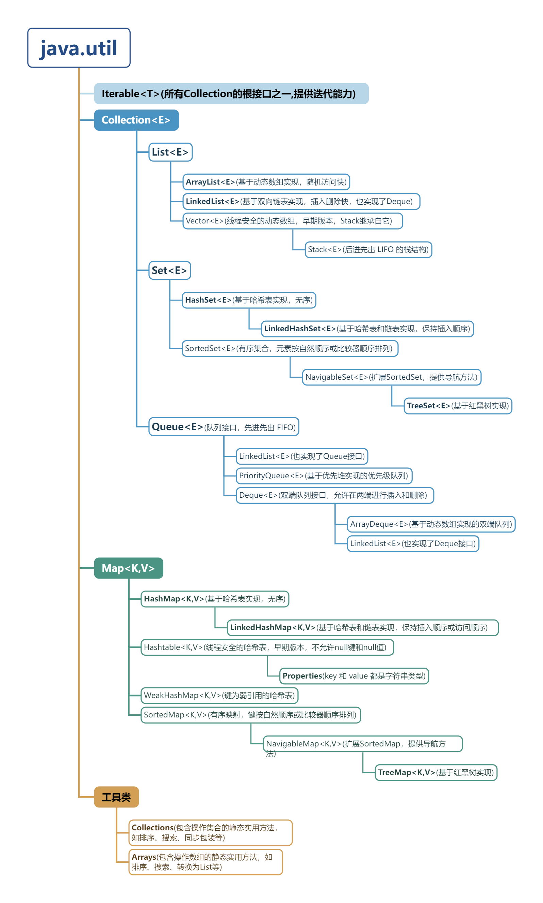

## 1. Java 集合对比数组的优点总结

Java 集合框架提供了比传统数组更强大、更灵活的数据存储和操作机制。其主要优点包括：

1.   **动态调整大小**：
    *   数组的长度在创建时固定，无法在运行时改变。如果需要存储更多元素，必须创建一个新数组并复制旧数组的内容。
    *   集合（如 `ArrayList`）的大小可以根据需要动态增长或缩小，无需手动管理容量。

2.   **丰富的数据结构支持**：
    *   数组仅提供线性存储。
    *   集合框架提供了多种复杂的数据结构，如列表（`List`）、集（`Set`）、队列（`Queue`）、映射（`Map`）等，每种结构都有其特定的用途和性能特点，可以更好地满足不同场景的需求。

3.   **内置的高效算法**：
    *   集合框架通常提供了对集合元素进行排序、搜索、迭代等操作的高效算法实现（例如通过 `Collections` 工具类）。
    *   使用数组时，这些算法通常需要开发者自行实现或依赖第三方库。

4.   **类型安全与泛型**：
    *   Java 集合框架全面支持泛型，可以在编译时检查存入集合的元素类型，避免了在运行时发生 `ClassCastException` 的风险。
    *   虽然数组在创建时也指定类型，但在处理不同类型的对象时，集合的泛型机制提供了更好的类型安全性和代码可读性。

5.   **易用性和更高的抽象级别**：
    *   集合框架提供了一系列方便的方法（如 `add`, `remove`, `contains`, `size` 等），使得数据操作更加直观和简洁。
    *   相比之下，数组的操作（如插入、删除元素）通常需要手动移动其他元素，较为繁琐。

6.   **多种实现选择**：
    *   对于同一种集合接口（如 `List`），有多种不同的实现类（如 `ArrayList`、`LinkedList`）。开发者可以根据具体应用场景（如频繁的随机访问或频繁的插入删除）选择最合适的实现，以获得最佳性能。数组则只有一种固定的实现。

7.   **线程安全选项**：
    *   集合框架提供了一些线程安全的集合类（如 `ConcurrentHashMap`, `CopyOnWriteArrayList` 或通过 `Collections.synchronizedList()` 等包装器），方便在多线程环境下使用。数组本身不是线程安全的，需要开发者自行处理同步问题。

## 2. Java 集合框架的结构图

Java 集合框架（Java Collections Framework, JCF）主要由一系列接口、实现这些接口的类以及操作这些对象的算法组成。下面是一个简化的结构图，展示了核心接口及其常见的实现类之间的层级关系：



```
java.util
│
├── Iterable<T> (所有Collection的根接口之一，提供迭代能力)
│
├── Collection<E> (集合层次结构的根接口)
│   │
│   ├── List<E> (有序集合，允许重复元素)
│   │   ├── ArrayList<E> (基于动态数组实现，随机访问快)
│   │   ├── LinkedList<E> (基于双向链表实现，插入删除快，也实现了Deque)
│   │   └── Vector<E> (线程安全的动态数组，早期版本，Stack继承自它)
│   │       └── Stack<E> (后进先出 LIFO 的栈结构)
│   │
│   ├── Set<E> (不允许重复元素的集合)
│   │   ├── HashSet<E> (基于哈希表实现，无序)
│   │   ├── LinkedHashSet<E> (基于哈希表和链表实现，保持插入顺序)
│   │   └── SortedSet<E> (有序集合，元素按自然顺序或比较器顺序排列)
│   │       └── NavigableSet<E> (扩展SortedSet，提供导航方法)
│   │           └── TreeSet<E> (基于红黑树实现)
│   │
│   └── Queue<E> (队列接口，先进先出 FIFO)
│       ├── LinkedList<E> (也实现了Queue接口)
│       ├── PriorityQueue<E> (基于优先堆实现的优先级队列)
│       └── Deque<E> (双端队列接口，允许在两端进行插入和删除)
│           ├── ArrayDeque<E> (基于动态数组实现的双端队列)
│           └── LinkedList<E> (也实现了Deque接口)
│
├── Map<K,V> (存储键值对的映射结构，键唯一)
│   │
│   ├── HashMap<K,V> (基于哈希表实现，无序)
│   ├── LinkedHashMap<K,V> (基于哈希表和链表实现，保持插入顺序或访问顺序)
│   ├── Hashtable<K,V> (线程安全的哈希表，早期版本，不允许null键和null值)
│   ├── WeakHashMap<K,V> (键为弱引用的哈希表)
│   └── SortedMap<K,V> (有序映射，键按自然顺序或比较器顺序排列)
│       └── NavigableMap<K,V> (扩展SortedMap，提供导航方法)
│           └── TreeMap<K,V> (基于红黑树实现)
│
├── 工具类
    ├── Collections (包含操作集合的静态实用方法，如排序、搜索、同步包装等)
    └── Arrays (包含操作数组的静态实用方法，如排序、搜索、转换为List等)

```

**说明：**

*   箭头或缩进通常表示继承或实现关系。
*   `<E>`、`<T>`、`<K,V>` 表示泛型类型参数。
*   此图主要展示核心接口和常用实现类，并未包含所有类和接口。
*   一些类可能实现多个接口（例如 `LinkedList` 同时实现了 `List`, `Deque`, `Queue`）。

